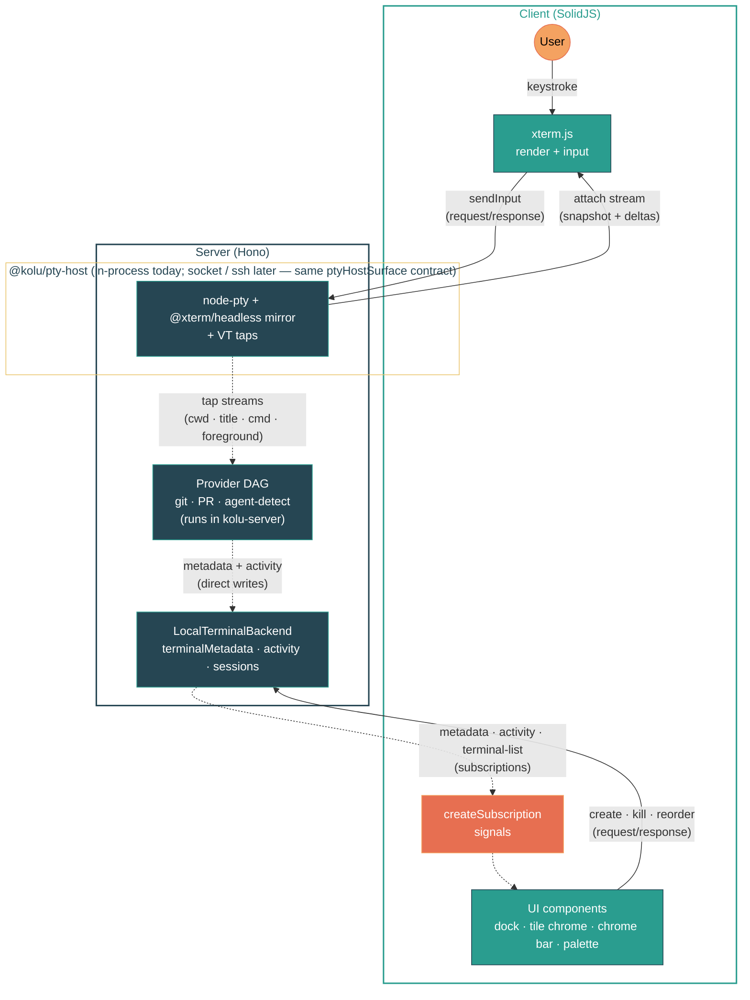

<p align="center">
  
</p>

# kolu

Your terminals are the workspace. Real `xterm.js` tiles on an infinite 2D canvas, for `claude`, `codex`, `opencode` — anything you run in a shell.

Unlike agent command centers that wrap a single model behind their own chat UI, kolu stays out of the agent's way: the terminal is the universal interface, so `claude`, `opencode`, or whatever ships next week works out of the box — and you can drop to a plain shell whenever you want. It's an [Agentic Development Environment](https://x.com/jdegoes/status/2036931874057314390) (ADE) that treats terminals as the thesis, not the substrate.

## Philosophy

Two principles shape what kolu is and isn't:

**Agent-agnostic.** The terminal is the universal interface. Kolu doesn't wrap a specific model or lock you into one CLI — `claude`, `opencode`, or whatever ships next week all work the same way, because they're just programs you run in a shell. There's no agent registry to update, no adapter to write, no vendor lock-in. Any new agent CLI picks up first-class features automatically: run it once in any kolu terminal and the next time you create a worktree, it appears in the sub-palette as a launch option — no configuration, no per-agent code. You can always drop to a plain shell without leaving the app.

**Auto-detected, zero setup.** Kolu populates its UI by watching what you already do — the repos you `cd` into, the agents you run, the sessions you save — not by asking you to configure it. Recent repos track `cd` events, branch / PR / CI status derive from the terminal's CWD, Claude Code state is read from the foreground pid, and recent agent CLIs come from preexec command marks emitted by kolu's shell integration. If kolu knows something, it's because the shell already told it. The surface grows with your workflow, not with a preferences pane.

## Usage

[Install Nix](https://nixos.asia/en/install) and then run:

The same command runs kolu and updates it — `--refresh` busts Nix's flake cache so you always pull the latest commit:

```sh
nix --refresh run github:juspay/kolu       # serve on 127.0.0.1:7681
nix --refresh run github:juspay/kolu -- --host 0.0.0.0 --port 8080  # expose on LAN
```

Open http://127.0.0.1:7681 (or the address you chose above).

## Features

### Terminals

- Create, switch, and kill terminals — every terminal renders as a draggable tile on the canvas, with the left-edge **dock** as the canonical at-a-glance navigator (rail / cards levels) and the **command palette** as the canonical search surface
- Split terminals — <kbd>Ctrl+&#96;</kbd> splits a bottom pane per terminal; <kbd>Ctrl+Shift+&#96;</kbd> adds tabs, <kbd>Ctrl+PageDown</kbd> / <kbd>Ctrl+PageUp</kbd> cycles. Open splits surface as an inline `▭ N` chip on the parent's dock row so the count is visible at a glance, not just on the active tile's title bar
- Font zoom (<kbd>Cmd/Ctrl</kbd> <kbd>+</kbd>/<kbd>-</kbd>), persisted per terminal across sessions
- WebGL rendering with canvas fallback, clickable URLs, Unicode 11, inline images (sixel, iTerm2, kitty)
- Clickable file references — terminal output that contains `path/to/file.ts:42` (with optional `:col` or `-end` line range) is linkified; clicking opens the file in the right panel's Code tab at that line
- Lazy attach — late-joining clients receive serialized screen state (~4KB) instead of replaying raw buffer
- Mobile key bar — on coarse-pointer devices, a thin row above the terminal sends the keys soft keyboards lack (<kbd>Esc</kbd>, <kbd>Tab</kbd>, arrows, <kbd>Ctrl+C</kbd>) plus an IME-bypassing <kbd>Enter</kbd> for Android chat keyboards, with a haptic tick on every tap. Two sticky modifiers (<kbd>Ctrl</kbd>, <kbd>Alt</kbd>) arm one-shot: tap to arm, then the next character — typed on the soft keyboard or sent from the bar — folds into the chord (e.g. <kbd>Ctrl</kbd>+<kbd>R</kbd>, <kbd>Alt</kbd>+<kbd>F</kbd>) and disarms. Touch-swipe inside the terminal scrolls the scrollback buffer

### Navigation

- Command palette (<kbd>Cmd/Ctrl+K</kbd>) — search terminals, switch themes, run actions
- Worktree-naming flow — drilling into `New terminal → <recent repo>` opens a leaf with the worktree name pre-filled (random ADJ-NOUN, auto-selected) and an agent picker below; type a custom name and hit Enter to land in a freshly-branched worktree, or pick an agent to launch it in one step. The typed name becomes the branch name and surfaces verbatim on the dock row, so worktrees stay identifiable at a glance
- Agent-aware command palette — once you've run a known agent CLI (`claude`, `aider`, `opencode`, `codex`, `goose`, `gemini`, `cursor-agent`) in any kolu terminal, it surfaces in two places: as a row in the worktree-naming leaf above (so the same Enter creates the worktree and launches the agent), and as the root-level `Recent agents` group under the **Active Terminal** section as a prefill-into-active-terminal affordance. Prompt/message flag values (`-p`/`--prompt`/`-m`/`--message`) are stripped before storage so ephemeral prompt text never lands in the persisted MRU
- Dock pings — when an agent finishes in the background with an unread completion, the dock row's state pip switches to a loud pulsing violet disk with a halo so you can spot it without panning. Once you activate the row the urgency drops — the pip falls back to a quiet dim dot if the agent's still technically awaiting, or whatever its current bucket says — so a row you've already glanced at doesn't keep yanking the eye. A simultaneous toast names the terminal that finished and carries a **Switch** action that pans the canvas to it; when the tab is backgrounded the OS notification does the same on click. <kbd>Ctrl+Tab</kbd> (or <kbd>Alt+Tab</kbd>) cycles terminals in MRU order: hold the modifier, press Tab to advance, release to commit
- Keyboard-driven — <kbd>Cmd+T</kbd> new terminal, <kbd>Cmd+1</kbd>…<kbd>Cmd+9</kbd> jump, <kbd>Cmd+Shift+[</kbd> / <kbd>Cmd+Shift+]</kbd> cycle, <kbd>Cmd+/</kbd> shortcuts help

### Canvas workspace

The desktop workspace is mode-less — every terminal renders as a draggable, resizable tile on an infinite 2D canvas. Per-terminal chrome (theme pill, agent indicator, screenshot, split toggle, find) lives on each tile's title bar. A transparent **chrome bar** floats at the top carrying logo, a **build/commit identity rail** (an `srv` connection + version readout whose commit links to its GitHub source; a `pty` column lands once the pty-host is a separate process), command palette, settings, and the maximize / dock / inspector toggles; the canvas grid reads through it. The left edge hosts the **dock** — the canonical live-terminal navigator. When the inspector panel opens, the chrome bar shrinks its right edge to the panel's left so the controls cluster stops short of the panel. When a tile is maximized, the chrome bar docks above and the dock renders as a flush left sidebar so the maximized terminal reflows next to it.

- **Infinite pan & zoom** — two-finger scroll / trackpad to pan, pinch or <kbd>Ctrl+scroll</kbd> to zoom. Hold <kbd>Shift</kbd> to force pan even with the cursor over a terminal tile (hand-tool style). No boundaries — the canvas extends freely in every direction via CSS `transform: translate() scale()` (Figma/Excalidraw model)
- **Snap-to-grid** — tiles snap to a 24px grid on drag and resize for tidy layouts
- **Maximize a tile** — double-click any tile's title bar (or click the maximize button on the tile, or the maximize toggle in the chrome bar) to fill the viewport; the maximized posture persists across reload via localStorage so you land back where you left off
- **Dock — two-level navigator** — the left-edge dock is the canonical live-terminal surface, with two progressive levels of detail (#903):
  - **Rail** — a 44 px-wide strip of 32 px chips, one per terminal. Each chip carries two glyphs (first alpha char of the repo + the intent's lead grapheme, falling back to the first alpha char of the branch tail) so two terminals in the same repo stay distinguishable — `Kf` is kolu/feat-dock-bare, `Kr` is kolu/remote-talk, and an intent like `🛟 FLOAT/right` chips as `K🛟` so the recognition cue cards mode shows survives at rail width. Repo color tints the chip's bg and ring; bucket state animates the ring (breath in `alert` for awaiting, accent spin-glow for working); active wears a 2 px accent halo; unread shows a pulsing alert badge at the corner. Tiny tinted repo dividers between adjacent chips from different repos carry the cards-mode section-header color into the rail.
  - **Cards** (default) — rows grouped by repo. Each repo gets a banded section header (uppercase name + repo-color swatch + row count); rows below stack as `state · branch · pips · time` lines. The first-column **state pip** encodes one thing: how urgent is this row? Shape carries the answer — a filled violet disk with a pulsing halo for **needs attention** (unread fresh background transition), a quiet dim violet dot for **awaiting** that you've already seen and let linger, a hollow spinning teal ring for **working**, a tiny muted dot for **idle**, empty for **none**. The violet "your turn" hue sits deliberately outside the warm/pending family (the CI-checks pip stays amber) so an agent waiting on you never reads as a build still churning. Different shapes (not just different colors) so the distinction survives reduced color sensitivity and peripheral glance. Agent kind (Claude / Codex / OpenCode) is not surfaced on the dock row — that identity lives on the terminal title bar where there's room. PR pip is a link to the PR with the live checks verdict + per-check list in its tooltip; the sub-terminal chip surfaces when there are nested terminals. The active row gets a quiet highlight (`bg-accent/15` + 3 px accent left-edge stripe); row geometry stays constant so the dock never reflows when the active terminal changes. Pip columns share a CSS subgrid across each section, so a column whose rows all lack a pip collapses to 0 width — branch labels get every pixel the icons aren't using.

  Workspace search lives in the unified **command palette** (#912): the dock's search-icon button (and <kbd>Cmd+Shift+K</kbd>) opens the palette pre-drilled into the "Search workspaces" group. The group renders its own body inside the palette — a repo-facet sidebar plus agent-state columns (`Idle`, `Awaiting you`, `Working`, `No agent`), with the `Idle` column sub-grouped by age (`4–12h`, `12–24h`, `24–48h`, `48h+`) the same way the minimap window picker shows it. The palette input drives an AND-token query across 20+ metadata fields; the body filters the visible cards live.

  Ordering is **pure recency at every layer** — the repo whose newest row just changed floats up, and within a repo the rows sort the same way. The bucket no longer promotes a row's position; "needs attention" is carried by the pip's pulse and color, not by where the row sits in the list. Rows are still clustered by branch/intent label so two terminals on the same branch stay adjacent — the cluster headline uses the same recency key, so clustering keeps siblings together without re-ordering the whole list. Click any dock row or palette workspace card to focus and center its tile. In maximized-tile mode the dock renders as an opaque flush-left sidebar and the maximized terminal reflows next to it (#904); in tiled mode the dock floats over the canvas as an equally opaque card so tiles never bleed through the seams.
- **Activity window — hard filter, not a dim** — a single per-device choice (`All / 4h / 12h / 24h / 48h`, default `24h`) governs the dock cutoff. Rows past the window disappear from the dock entirely. The dock's bottom strip carries both the disclosure and the picker inline ("`6 hidden by 4h window — show all`"); when nothing is parked it still reads `0 hidden by 4h window` so the control stays reachable. The "show all" shortcut surfaces only when something is actually hidden. The minimap's matching pill drives the same shared signal (via the same `ActivityWindowChip`), so tightening one tightens the other. The canvas tile fades, the hidden terminal stops counting toward the OS/PWA dock badge, and any fresh agent transition surfaces it automatically.
- **Minimap heatmap** — the canvas minimap dots any tile whose agent is currently `waiting` (alert color) or `thinking`/`tool_use` (accent color), suppressed once the tile falls outside the activity window, so you can scan a 20-tile workspace for "who needs me" or "who is making progress" without opening the switcher. Tiles outside the window collapse to small ghost markers so visual weight shifts onto what's still in play.
- **Identity-collision suffix** — when two terminals share the same repo+branch (or cwd, for non-git), the server assigns each a stable 4-char id suffix (`#a3f2`) so the dock and tile chrome can disambiguate them at a glance
- **Canvas navigation** — the command palette can center the active tile when panning has moved it out of view, or arrange the canvas by repo to cluster each repo's tiles into a square-ish island while preserving every tile's current size. New tiles join their repo's cluster in the same square-ish layout automatically — opening many worktree terminals fills out a 2×2, 3×2, … grid instead of a 1×N row
- **Per-tile theming** — title bars and pill swatches derive their colors from each terminal's theme for guaranteed contrast
- **Mobile** — the canvas, pan/zoom, and the desktop dock are disabled; the active tile fills the viewport and swipe-left/right cycles between terminals in compact switcher order. Switching or revealing a tile never raises the soft keyboard — it appears only when you tap the terminal, so it stays out of the way while you navigate. A pull-down chrome sheet at the top reveals the same logo + vertical switcher list + controls as a touch-sized drawer. The right panel — Inspector + Code tabs, file tree, HTML/SVG/PDF iframe + image preview — hosts as a **bottom drawer** instead of a side split, mounting the same `RightPanel` → `CodeTab` subtree as desktop; tap the inspector toggle in the chrome sheet (or a `path:line` link in terminal output) to open it

### Git & GitHub

- Auto-detected repo name, branch, and working directory (via OSC 7 + `.git/HEAD` watcher)
- GitHub PR detection — shows the merge-state icon (open / merged / closed), CI check status dot (pass/pending/fail), `#N`, and PR title on the tile chrome, the inspector, **the dock row, and the workspace-switcher card** so the merge state is visible from every navigator surface without focusing the tile
- Per-repo color coding on the dock, tile chrome, canvas tile border, and minimap via golden-angle hue spacing — the same hue echoes across every surface so a repo reads as one identity at a glance
- Inline preview of agent-generated `.html` / `.svg` / `.pdf` artifacts — selecting one in the Code tab's browse mode renders it in a sandboxed iframe (`sandbox="allow-scripts"`, no `allow-same-origin` — page scripts run in an opaque origin and can't touch Kolu's cookies/localStorage; cross-origin `fetch()` from inside is blocked, which is fine for static artifacts) served from a per-terminal route under the terminal's repo root. Raster images (`.png` / `.jpg` / `.gif` / `.webp` / `.ico`) are served by the same route but presented with a plain `` centered on a checkerboard, so transparency reads against the dark panel — no script sandbox needed since image bytes can't execute. Both live-reload when the file changes (mtime bump on the URL) via the same `fsReadFile` subscription path as text
- Rendered Markdown with a **Source ⇄ Rendered toggle** — opening a `.md` / `.markdown` file in the Code tab's browse mode renders it as a reading document (via `@kolu/solid-markdown`), not raw source. A small segmented toggle in the file header flips to the syntax-highlighted source (for exact syntax, copy, or line-anchored comments) and back; rendered is the default. Markdown stays a text file on the wire (`fsReadFile` `kind:"text"`) — it renders client-side from its own `content`, so the toggle is offered because the file has *both* a source and a rendered form. The same toggle host (`@kolu/solid-fileview`) will later light up for HTML/SVG
- Comments on any file — select text in a source file, branch diff, or rendered HTML artifact and a floating "+ Comment" pill appears next to the selection; click it to attach a free-text note. Comments accumulate in a tray at the bottom of the Code tab across every file in the worktree's repo; "Copy to clipboard" flushes the queue as a plain Markdown list ready to paste into the agent's prompt. Anchors use the W3C TextQuoteSelector model (quote + ±32-char context), so the agent receiving the payload can re-locate the position by grep even after the file is edited. The same anchor model — and the same pure `extractQuote` / `findQuote` functions — powers both the parent-side surface (Pierre's `CodeView`) and the in-iframe HTML annotator served by `@kolu/artifact-sdk`. Comments persist per repo via `localStorage` (keyed by `git repoRoot`, so they survive worktree switches) and render in place via the CSS Custom Highlight API where supported

### Claude Code Status

Detects [Claude Code](https://docs.anthropic.com/en/docs/claude-code) sessions running in any terminal and surfaces their state on the tile's chrome and in the dock.

**What we detect:**

| State                 | Indicator           | Meaning                                                                                                                                                              |
| --------------------- | ------------------- | -------------------------------------------------------------------------------------------------------------------------------------------------------------------- |
| Thinking              | Pulsing accent dot  | API call in flight — Claude is generating a response                                                                                                                 |
| Tool use              | Pulsing yellow dot  | Claude is executing tools                                                                                                                                            |
| Running in background | Spinning working ring | Claude ended its turn while a background task it launched (a [dynamic workflow](https://code.claude.com/docs/en/workflows), a backgrounded `Bash` command, or a background `Task`/`Agent`) is still running — it is busy-waiting on that task, not awaiting you, so it buckets as *working* rather than *awaiting* and never falsely pings |
| Waiting               | Dim dot             | Claude finished responding — or the turn was interrupted with Esc — and is idle, waiting for user input                                                              |

**How it works:** asks each terminal for its current foreground process pid via `tcgetpgrp(fd)` (exposed by node-pty's `foregroundPid` accessor), then checks whether `~/.claude/sessions/<fgpid>.json` exists. If it does, that terminal is running claude-code — we tail the session's JSONL transcript to derive state from the last message. The tail is also scanned for background tasks the agent launched — a dynamic `Workflow`, a backgrounded `Bash` command, or a background `Task`/`Agent` — that haven't yet reported a terminal status via a `queue-operation` completion; when one is outstanding, a bare end-of-turn is promoted from *waiting* to *running in background* so a busy-waiting agent doesn't read as needing you. An interrupted turn (Esc) appends a trailing `user` entry carrying an explicit interrupt marker (`[Request interrupted by user]`, or an errored `tool_result` for a mid-tool-call Esc); that marker reads as *waiting* (idle), not *thinking* — so the dock settles instead of animating a phantom spinner that persists across `claude -c`. Cross-platform (Linux + macOS) since `tcgetpgrp` is POSIX. Each card also surfaces the session's display title (custom title › auto-generated summary › first prompt) via the [Claude Agent SDK](https://platform.claude.com/docs/en/api/agent-sdk/typescript)'s `getSessionInfo()`, refreshed best-effort on each transcript change. The tile chrome also shows a running token count (compact, e.g. `47K`) summed from the latest assistant entry's `message.usage` — `input_tokens + cache_creation_input_tokens + cache_read_input_tokens`. Raw count only; window size isn't inferable from the JSONL (1M beta strips its suffix, so a `%` would lie), and the raw number is the useful signal anyway.

**What we can't detect:**

- **`AskUserQuestion` / `ExitPlanMode` / permission prompts — anything that blocks waiting for the user.** Claude Code's SDK buffers the in-flight assistant message for tools that declare `requiresUserInteraction(){return true}` (the two named tools) and never persists the `tool_use` block to JSONL until the user resolves the prompt. By that point the question is answered and the state has moved on. The integration's state machine carries an `awaiting_user` case (codeshare with Codex/OpenCode where the on-disk signal does exist), but for Claude Code it never fires under the current SDK. Tracked in #905 — fix requires a `PreToolUse` hook side-channel (cmux-style)
- **Streaming progress** — intermediate thinking tokens aren't tracked, only final state transitions
- **Wrapped invocations** — if claude-code is launched via a wrapper (e.g. `script -q out.log claude`), the foreground pid is the wrapper, not claude itself, so the session lookup misses
- **Sub-agents** — individual nested agent spawns aren't tracked as separate sessions. When the parent ends its turn to wait on a launched _dynamic workflow_, though, Kolu surfaces that workflow's fan-out — its name and live sub-agent count, read from the run journal at `<session>/workflows/<runId>.json` — on the tile chrome and inspector while the parent is `running in background`

**Debugging detection:** the command palette has a `Debug → Show Claude transcript` entry (visible only when the active terminal has a Claude session) that opens a side-by-side view of the server's state-change log next to the raw JSONL events from disk since monitoring began. Use it when state seems stuck or transitions feel missed.

### Codex Status

Detects [Codex](https://github.com/openai/codex) TUI sessions and surfaces their state alongside Claude Code and OpenCode.

**How it works:** when the foreground process is `codex`, the provider queries Codex's threads SQLite DB (highest-numbered `~/.codex/state_<N>.sqlite`, auto-discovered on startup) to find the most recently updated non-archived `cli` thread whose `cwd` matches the terminal's CWD. Thread metadata (title, model) comes straight from indexed columns. The running context-token count and the agent state (thinking / tool*use / waiting) both come from tailing the per-thread rollout JSONL at `threads.rollout_path`: `state` from pattern-matching `task_started` / `task_complete` / `function_call` / `function_call_output` events, and `contextTokens` from reading `info.last_token_usage.input_tokens` on the latest `token_count` event — the same number Codex's own `/status` command displays. Live updates come from `fs.watch` on the SQLite WAL file (`state*<N>.sqlite-wal`); Codex writes the WAL and appends the JSONL in the same cycle (verified: nanosecond-identical mtimes), so one signal covers both sources.

**Why `last_token_usage.input_tokens` alone, not a sum?** Claude-code sums three input-side fields (`input_tokens + cache_creation + cache_read`) because Anthropic's schema makes them disjoint buckets. OpenAI's schema — which Codex emits — is different: `input_tokens` is _already_ the full prompt, and `cached_input_tokens` is a breakdown of what portion was a cache hit, not an additional count. Adding them double-counts every cache re-read. The field as-is is what `/status` reports and what gives users an accurate read on context pressure.

**Why not `threads.tokens_used`?** That column holds the session-lifetime cumulative total (`total_token_usage.total_tokens` summed across every turn). For long-running sessions it climbs into tens of millions — misleading as "how close am I to exhausting the 258 K context window."

**Why both SQLite and JSONL?** SQLite alone gives us title and model cheaply from indexed columns — no file read, no parsing. JSONL alone would force re-parsing the entire file on every update to recover title. Neither source alone carries both the event stream that drives state AND the per-turn token usage AND the columns that drive metadata — combining them specializes by purpose.

**What we detect:**

| State          | Indicator          | How                                                                                                                                                          |
| -------------- | ------------------ | ------------------------------------------------------------------------------------------------------------------------------------------------------------ |
| Thinking       | Pulsing accent dot | Latest lifecycle event is `task_started`, with no open `function_call` scoped to the current turn                                                                                                                              |
| Tool use       | Spinning yellow    | Latest lifecycle event is `task_started`, with at least one open `function_call` that isn't a known awaiting-user tool                                                                                                         |
| Awaiting input | Pulsing alert      | Every open `function_call` names a known awaiting-user tool — `request_user_input` (Plan mode), `request_permissions` (all modes), or `request_plugin_install`. Codex is blocked on the user, not running compute |
| Waiting        | Dim dot            | Latest lifecycle event is `task_complete`                                                                                                                                                                                      |

Open-call tracking is scoped per-turn: a `function_call` with no matching `_output` that straddles a `task_started` boundary (user aborted a prior tool-using turn) does not pin the next turn to `tool_use`.

**What we can't detect (yet):**

- **Task-progress checklist** — Codex has no TodoWrite equivalent (`task_started`/`task_complete` are per-turn lifecycle, not user-visible checklists), so the `taskProgress` field stays permanently null
- **Column-level schema changes** — the filename version is auto-discovered, but if upstream renames or removes a depended-on column in the `threads` table (e.g. `rollout_path`, `cwd`, `source`, `archived`), session detection silently returns zero matches. Set `KOLU_CODEX_DB` to pin a known-good DB while a fix ships
- **Same-directory disambiguation** — if multiple Codex threads share a cwd, we pick the most recently updated one (same heuristic as OpenCode)
- **Sub-agent threads** — Codex's spawned sub-agents get `source = '{"subagent":…}'` rows in the same table; we filter them out (they have no foreground terminal to bind to)

### OpenCode Status

Detects [OpenCode](https://github.com/anomalyco/opencode) sessions and shows their state alongside Claude Code on the tile chrome.

**How it works:** when the foreground process is `opencode`, the provider queries OpenCode's SQLite database directly at `~/.local/share/opencode/opencode.db` to find the most recently updated session whose `directory` matches the terminal's CWD. State is derived from the latest message: a user message means the assistant is _thinking_; an assistant message with `time.completed` set and `finish: "stop"` means _waiting_; otherwise still _thinking_. Todo progress comes from a `COUNT(*)` over the `todo` table — much simpler than Claude Code's tool-call parsing since OpenCode stores todos as first-class rows with a `status` column. The tile chrome also shows the running token count from the latest assistant message's `tokens.total` (pre-summed by OpenCode — we pass it through). Live updates come from `fs.watch` on the SQLite WAL file (`opencode.db-wal`), which OpenCode writes to on every database mutation.

**Why SQLite, not REST?** The OpenCode TUI doesn't expose an HTTP server by default — that's a separate `opencode serve` mode. Reading the SQLite DB directly works against the actual TUI users run, with no port discovery and no extra processes. SQLite WAL mode allows concurrent readers while OpenCode is writing, so we can open the DB read-only without blocking it.

**What we detect:**

| State          | Indicator          | How                                                                                                          |
| -------------- | ------------------ | ------------------------------------------------------------------------------------------------------------ |
| Thinking       | Pulsing accent dot | Latest assistant message has no `time.completed`                                                                                                   |
| Tool use       | Spinning yellow    | Thinking + at least one `part` with `state.status: "running"` whose `tool` field is neither `question` nor `plan_exit`                             |
| Awaiting input | Pulsing alert      | Thinking + every running `part`'s `tool` is `question` (structured prompt) or `plan_exit` (plan-mode approval gate) — blocked on a human reply     |
| Waiting        | Dim dot            | Latest assistant message has `time.completed` set and `finish: "stop"`                                                                             |

**What we can't detect (yet):**

- **Same-directory disambiguation** — if multiple OpenCode sessions share a working directory, we pick the most recently updated one
- **Non-default DB location** — set `KOLU_OPENCODE_DB` to override the path

### Theming

- 200+ color schemes from [iTerm2-Color-Schemes](https://github.com/mbadolato/iTerm2-Color-Schemes), switchable at runtime
- Live preview while browsing themes in the palette
- Shuffle theme — new terminals (and the active one on <kbd>⌘J</kbd>) get a background perceptually distinct from every other open terminal (toggleable; on by default)
- Dark / light / system UI theme
- Installed PWA chrome color derives from the server hostname, so app windows from different machines are easier to distinguish

### Clipboard

- <kbd>Ctrl+V</kbd> pastes images into any agent that accepts paste-as-file-path (Claude Code, codex, …) — the server saves the browser's clipboard image and bracketed-pastes its path into the PTY
- **Drag-and-drop files** onto a terminal — the file uploads to the server (10 MB cap, curated extension allowlist covering text, code, structured data, common docs, and images) and its path is bracketed-pasted into the PTY just like a clipboard image, so agents that accept paste-as-file-path pick it up automatically. Disallowed types and oversize drops are rejected client-side with a toast and never hit the wire

### Screen recording

Record the Kolu tab — whole canvas or a single maximized terminal — with microphone and optional webcam PiP, straight to a local `.webm` file. Chromium-only (uses the File System Access API).

- **One-click setup popover** — mic picker with live 8-segment RMS level meter, webcam toggle + device picker + circular preview, all in a compact popover anchored to the chrome-bar record button
- **Streaming to disk** — chunks flow from `MediaRecorder` into a `FileSystemWritableFileStream` continuously, so memory stays flat regardless of recording length. A partial `.webm` survives a browser crash (recoverable with ffmpeg)
- **Duration-fix pass** — Chrome's `MediaRecorder` omits the WebM `SegmentInfo.Duration` header in streaming mode, which makes players show a ~1 second duration. At stop, the saved file is read back, patched via [`fix-webm-duration`](https://github.com/yusitnikov/fix-webm-duration), and rewritten
- **Pause / resume** — <kbd>⌘⇧.</kbd> toggles; the segmented recording capsule in the chrome bar shifts red → amber and the breathing halo suppresses while paused
- **Webcam PiP overlay** — when enabled, a circular mirrored `<video>` pins to the bottom-right above maximized tiles but below the chrome bar, and is baked into the recording by the tab-capture stream (no offscreen compositing)
- **Browser picker collapses** — `getDisplayMedia({ preferCurrentTab: true, selfBrowserSurface: "include" })` turns the multi-surface picker into a single "Share this tab" confirmation

### Transcript export

Command-palette entry "Export agent session as HTML" (visible only when the active terminal has an agent session) saves the current Claude Code, OpenCode, or Codex transcript as a single self-contained `.html` file — no external assets, no server upload, opens in any browser offline.

- **Vendor-neutral IR** — each integration loader normalizes its session storage (Claude's JSONL, OpenCode's SQLite, Codex's rollout) into the same `TranscriptEvent` union in `kolu-transcript-core`. The renderer dispatches on `event.kind`, never on the agent — adding a new vendor's quirky tool name is a loader-side change with zero renderer churn
- **Typed `ToolInput` union** — every Claude Code built-in tool ([34 entries](https://code.claude.com/docs/en/tools-reference): Edit/Bash/Skill/TaskCreate/WebSearch/PowerShell/…) and every OpenCode built-in tool ([13 entries](https://opencode.ai/docs/tools/): edit/bash/todowrite/lsp/question/…) maps to a kind the renderer can specialise on. Anything we haven't modelled lands honestly in `kind: "unknown"` with the original `toolName` preserved — the document never lies about what a tool was
- **Code surfaces through Pierre** — `Edit`, `Write`, fenced markdown code, and Codex `apply_patch` all flow through [`@pierre/diffs`](https://www.npmjs.com/package/@pierre/diffs)'s SSR. Each chunk hydrates into a `<diffs-container>` custom element; a tiny inlined bootstrap shares Pierre's ~43KB core stylesheet across every chunk via `adoptedStyleSheets` so the per-event payload stays small
- **Warm-parchment editorial layout** — serif prose, mono code, role-tinted gutters, sticky dock for hide-tools / hide-reasoning / theme cycle, `j`/`k` to step between prompts, Reddit-style indent for nested subtask blocks
- **Theme follows the toggle** — manual dark/light flip flows through to Pierre's shiki tokens via `color-scheme: inherit !important` on `<diffs-container>`, so the whole document (chrome + code) flips together instead of Pierre staying in the system-preferred mode

## Architecture

pnpm monorepo:

| Package                              | Stack                                                                                                                                                                 |
| ------------------------------------ | --------------------------------------------------------------------------------------------------------------------------------------------------------------------- |
| `packages/common/`                   | [oRPC](https://orpc.dev/) contract + [Zod](https://zod.dev/) schemas + cell descriptors                                                                               |
| `packages/surface/`                  | Reactive state framework — typed `Cell<T>`, `Collection<K,T>`, `Stream<I,T>`, `Event<I,T>` over oRPC streams; SolidJS hooks (`useCell`, `useCollection`, `useStream`, `useEvent`)               |
| `packages/solid-pierre/`             | Solid-native wrappers around [`@pierre/trees`](https://www.npmjs.com/package/@pierre/trees) and [`@pierre/diffs`](https://www.npmjs.com/package/@pierre/diffs); encapsulates Pierre's imperative mount/render lifecycle behind `<FileTree>` and `<CodeView>` with required `onError` props. `<CodeView>` (Pierre's 1.2.x advanced-mode viewport) hosts files and/or diffs in one virtualized scroll — windowed-rendering is unconditional, so single-file callers ride the same path as future multi-file ones |
| `packages/solid-markdown/`           | App-agnostic safe Markdown → SolidJS renderer built on [`marked`](https://marked.js.org/) (GFM) — a `safeHref` allowlist and no raw-HTML injection (`html` tokens render as escaped text). One `<Markdown>` component with `inline` / `compact` / `document` variants bundling parse mode + styling scale. Kolu's intent surface consumes it, and the `document` variant backs the Code-tab's Markdown rendered-appliance (`@kolu/solid-fileview/renderers/markdown`) that powers the Source ⇄ Rendered preview |
| `packages/solid-fileview/`           | App-agnostic file-preview "outlet". `<FileView>` owns the Source ⇄ Rendered toggle, mode-availability logic (offered iff a file has *both* a source and a rendered form), and the renderer-registry pick — the core has **no rendering dependencies of its own**: the source view and every rendered form are injected `Renderer` values, and each concrete renderer is a separate `/renderers` sub-path appliance. Ships generic `image` / `iframe` / `markdown` appliances (the `markdown` one wires `@kolu/solid-markdown`). Kolu's Code-tab plugs in pierre-source + markdown + image + an iframe wrapped with the artifact-sdk comment bridge, so `right-panel/BrowseFileDispatcher` is a thin `fsReadFile`→`FileView` adapter rather than bespoke render wiring; `.md` now shows the toggle (rendered by default) |
| `packages/artifact-sdk/`             | Self-contained comments-on-files toolkit. Three exports: `./core` (pure W3C TextQuoteSelector functions used by both runtimes), `./client` (parent-side iframe ↔ parent bridge + core re-exports), `./server` (one-line `mountArtifactSdk(app, ...)` that wires the SDK bundle route and an HTML-decoration middleware — esbuild bundles the in-iframe script at server startup, hash-keyed for cache busting). The host server never imports HTML rewriting logic |
| `packages/server/`                   | [Hono](https://hono.dev/); owns `@kolu/pty-host` in-process but consumes it through the typed `ptyHostSurface` contract (an in-process link), and runs the per-terminal provider DAG fresh in kolu-server against its taps                     |
| `packages/pty-host/`                 | The multi-client PTY-owner primitive + its wire contract — [node-pty](https://github.com/microsoft/node-pty) + [@xterm/headless](https://www.npmjs.com/package/@xterm/headless) screen mirror + VT-derived taps (OSC 7 cwd, OSC 0/2 title, OSC 633 command-run, foreground, exit), each fanned out to many consumers via a bounded `Channel`. Owns *only* the PTY; race-free `attach` (snapshot+deltas). `ptyHostSurface` is the typed contract for consuming it — in-process today, the identical shape rides a socket / ssh later |
| `packages/integrations/pty/`         | Shell-environment prep for PTY spawning — Nix-devshell env filtering, kolu identity vars, and the per-PTY wrapper rc-file that replays user dotfiles and injects kolu's OSC hooks. Callers compose these and hand the result to `@kolu/pty-host`'s `spawn`; Node-stdlib only |
| `packages/client/`                   | [SolidJS](https://www.solidjs.com/) + [xterm.js](https://xtermjs.org/) + [Tailwind CSS v4](https://tailwindcss.com/)                                                  |
| `packages/integrations/claude-code/` | Claude Code detection — JSONL transcript tailing + Claude Agent SDK; exports a `claudeCodeProvider` `AgentProvider`                                                   |
| `packages/integrations/anyagent/`    | Agent-agnostic shared contract (`AgentProvider` interface, `agentInfoEqual`), types (Logger, TaskProgress), and agent CLI parsing                                     |
| `packages/integrations/codex/`       | Codex detection — reads the highest-numbered `~/.codex/state_<N>.sqlite` for thread metadata and tails the matched rollout JSONL for state; exports a `codexProvider` |
| `packages/integrations/opencode/`    | OpenCode detection — reads OpenCode's SQLite database via Node's built-in `node:sqlite`; exports an `opencodeProvider` `AgentProvider`                                |
| `packages/integrations/git/`         | Pure git operations — `simple-git` wrapper: repo resolution, worktree lifecycle, diff review, path security; schemas re-exported by `kolu-common`                     |
| `packages/integrations/github/`      | GitHub PR schemas + pure helpers (`deriveCheckStatus`, `classifyGhError`, `prResultEqual`); server wraps with `gh pr view` spawn via `KOLU_GH_BIN`                    |
| `packages/integrations/io/`          | Filesystem & I/O primitives — refcounted shared `fs.watch` keyed by directory (`createDirFilenameWatcher`); its only dependency is the types-only `@kolu/log` leaf, so any package can adopt it without runtime coupling |
| `packages/transcript-core/`          | Vendor-neutral transcript IR (`Transcript`, `TranscriptEvent`, typed `ToolInput` union) + structural transforms; per-agent loaders normalize into this shape          |
| `packages/transcript-html/`          | Static-export renderer — `marked` for prose, [`@pierre/diffs`](https://www.npmjs.com/package/@pierre/diffs) SSR for shiki-tokenized code/diffs, [Preact](https://preactjs.com/) JSX for chrome; emits one self-contained `.html` |
| `packages/terminal-themes/`          | Terminal color scheme catalog + perceptual-distance picker — themes checked-in as JSON                                                                                |
| `packages/memorable-names/`          | ADJ-NOUN random name generator — word lists checked-in as JSON                                                                                                        |
| `packages/log/`                      | Structured-logging contract (`Logger`) — a zero-runtime-dependency, zero-`kolu-*`-dependency leaf, so even packages that refuse a `kolu-shared` dep import one canonical type instead of re-declaring it (`kolu-shared`, `kolu-io`, `kolu-transcript-core` all defer here) |
| `packages/html-escape/`              | `escapeHtml` — a zero-dependency leaf, so app-agnostic appliances (`transcript-html`, the scrollback PDF export) reach it without dragging the `kolu-common` domain contract into their dependency tree |

### Communication

All traffic flows over a single WebSocket (`/rpc/ws`) via [oRPC](https://orpc.dev/). The contract in `packages/common/` is shared by both sides — types checked at compile time, payloads validated by Zod at runtime. Two communication patterns:

| Pattern            | Semantics                                  | Client integration                    | Used for                                               |
| ------------------ | ------------------------------------------ | ------------------------------------- | ------------------------------------------------------ |
| Request / response | one-shot RPC call                          | plain `client.*` calls                | `terminal.create`, `terminal.kill`, `terminal.reorder` |
| Subscription       | server pushes values over WebSocket stream | `createSubscription` → SolidJS signal | Terminal list, metadata, server state                  |

Subscriptions use [`createSubscription`](packages/client/src/rpc/createSubscription.ts) — a 150-line primitive that converts an `AsyncIterable` into a SolidJS signal via `createStore` + `reconcile` for fine-grained reactivity. Per-terminal subscriptions use SolidJS's `mapArray` for automatic lifecycle management.

### Data flow

Two loops drive the system — a **terminal I/O loop** (the hot path) and a **metadata loop** (side-channel enrichment). Both flow over the same WebSocket and land in SolidJS signals on the client via `createSubscription`.



**Terminal I/O** (solid lines) — keystrokes go through `sendInput` RPC to the PTY owned by [`@kolu/pty-host`](packages/pty-host/), which kolu-server drives over the `ptyHostSurface` contract; shell output flows back as an `attach` stream — a screen-state snapshot followed by the live delta stream, partitioned race-free at a single point so nothing is lost or double-painted — to xterm.js. The host's @xterm/headless mirror parses VT sequences server-side for those snapshots[^lazy-attach], and fans the output out to every attached client through a bounded `Channel`.

**Metadata** (dashed lines) — every per-terminal observer lives in the provider DAG at [`packages/server/src/terminalBackend/providers.ts`](packages/server/src/terminalBackend/providers.ts), parameterized over `ProviderHooks` + `ProviderChannels` so the host is the only thing that varies. The DAG runs in kolu-server itself ([`LocalTerminalBackend`](packages/server/src/terminalBackend/local.ts), the concrete `TerminalBackend` for "this kolu process"), fed `@kolu/pty-host`'s raw VT taps over the `ptyHostSurface` contract — an in-process *identity link* today ([`directLink`](packages/surface/src/links/direct.ts) over `servePtyHost`'s router — a direct client, no wire), so the exact same consumer code runs unchanged when pty-host later moves behind a socket or ssh. The backend constructs a `ProviderRecord {pid, meta, currentAgent}` — never a `PtyHandle`, so the DAG has zero synchronous dependency on the host (the live foreground reads it once read off the handle now arrive on a `foreground` tap) — wires `ProviderHooks` that write straight to the `terminalMetadata` collection + activity feed, and calls `startProviders`. The `terminals:dirty` autosave fires only for the server-persisted half (the `metadata.ts` write-fence: writing a live-only field through `updateServerMetadata` is a compile error). Decoupling the DAG from the handle — reading taps, not a `PtyHandle` — is what lets it run unchanged whether pty-host is in-process, behind a socket, or on an ssh host; `Local`- and `RemoteTerminalBackend` then differ only in which transport builds the pty-host client. The DAG itself: CWD changes (OSC 7) → git provider (`.git/HEAD` watcher) → GitHub provider (`gh pr view` polling). Agent detection uses a single generic orchestrator (`startAgentProvider` in `providers.ts`) driven by per-agent `AgentProvider` instances from each integration package. Today three instances are registered: `claudeCodeProvider` (from `kolu-claude-code`) wakes on title events (OSC 2) and its own `fs.watch` on `~/.claude/sessions/`; `codexProvider` (from `kolu-codex`) queries the highest-numbered `~/.codex/state_<N>.sqlite` for thread metadata and tails the matched rollout JSONL for state transitions; `opencodeProvider` (from `kolu-opencode`) queries OpenCode's SQLite database directly and watches its WAL file for live state updates. Adding a new agent CLI is one new `AgentProvider` and one line in `startProviders` — no server-side adapter file. All providers write to kolu-server's `terminalMetadata` collection, pushed to the client as a subscription[^providers]. Separately, kolu's preexec hook emits an `OSC 633;E` command mark before each user command; `@kolu/pty-host` surfaces it on its command-run tap, the backend bridges that onto a per-terminal `commandRun` channel, and the agent-command tracker (in `providers.ts`) subscribes to match the first token against a known-agents allowlist and fan out to both (a) a `recentAgent` signal into kolu-server's bounded recent-agents MRU for the agent-aware command palette and (b) a per-terminal stash keyed by terminal id, so codex/opencode session detection still matches when the agent is an interpreter shim (e.g. npm-installed `codex`, whose kernel-level process name is `node`). No `/proc` lookups or argv scraping. The `TerminalBackend` interface itself lives in [`kolu-common/terminalBackend`](packages/common/src/terminalBackend.ts) — `LocalTerminalBackend` is one concrete shape; a future `RemoteTerminalBackend` (for terminals running on SSH hosts) is the other, and every call site downstream goes through `getTerminalBackendFor(location)` so neither asks "which kind?".

**User actions** — the unified command palette (Cmd+K for commands; Cmd+Shift+K or the dock's search-icon button to drill into "Search workspaces") and tile chrome dispatch plain oRPC client calls ([`useTerminalCrud`](packages/client/src/terminal/useTerminalCrud.ts), [`useWorktreeOps`](packages/client/src/terminal/useWorktreeOps.ts)). The server's live subscriptions push updated state to the client automatically. [`useTerminalMetadata`](packages/client/src/terminal/useTerminalMetadata.ts) uses SolidJS's `mapArray` to create per-terminal subscriptions that automatically tear down when terminals are removed[^client-state].

[^lazy-attach]: ~4 KB serialized snapshot instead of replaying the full scrollback buffer.

[^providers]: Git provider uses [simple-git](https://github.com/steveukx/git-js); GitHub provider derives combined CI status from `CheckRun` + `StatusContext`. Agent providers implement the shared `AgentProvider` contract (`anyagent`): `resolveSession(terminalState)` → `sessionKey(session)` for dedup → `createWatcher(session, onChange)` for per-session state derivation, with an optional `externalChanges: { isPresent, install }` pair for out-of-band match triggers — `install` fires at most once per process, lazily, the first time any terminal's state reports `isPresent` true, so a user who has never run the agent pays zero watcher cost. `claudeCodeProvider` asks the pty for `tcgetpgrp(fd)` and stats `~/.claude/sessions/<fgpid>.json`, opts into `fs.watch` on `~/.claude/sessions/` as its external-change signal, then tails the matched session's JSONL transcript via another `fs.watch` for state updates; the session display title comes from a fire-and-forget [`getSessionInfo()`](https://platform.claude.com/docs/en/api/agent-sdk/typescript) call piggybacking on the same transcript watcher. `codexProvider` matches when either the foreground process basename is `codex` or the preexec stash names `codex` (interpreter-shim fallback), queries Codex's threads SQLite DB (highest-numbered `~/.codex/state_<N>.sqlite`) filtered to `source = 'cli'` for the cwd's latest thread, reads mutable metadata (title, model) from indexed columns, and tails the thread's rollout JSONL (`threads.rollout_path`) to derive state from `task_started` / `task_complete` boundaries and open `function_call` call_ids — one shared `fs.watch` on the SQLite WAL file doubles as both the external-change signal and the per-session refresh trigger, since Codex writes the WAL and appends the JSONL atomically. `opencodeProvider` matches via the same dual signal (foreground basename or preexec stash), queries `~/.local/share/opencode/opencode.db` (SQLite) for sessions in the terminal's CWD, and watches the WAL file (`opencode.db-wal`) for live state updates via Node's built-in `node:sqlite` module — it has no external-change subscription because title events cover every match transition.

[^client-state]: Local-only view state (active terminal, MRU order, attention flags) lives in SolidJS [signals and stores](https://docs.solidjs.com/reference/store-utilities/create-store) inside singleton `useXxx.ts` modules — separate from server-derived subscription state.

**Persistence** — sessions auto-save to `~/.config/kolu/state.json` via [`conf`](https://github.com/sindresorhus/conf), debounced at 500 ms[^persistence].

[^persistence]: Schema is versioned with explicit migrations. Stores CWD, sort order, and parent relationships per terminal.

[PartySocket](https://docs.partykit.io/reference/partysocket-api/) handles WebSocket auto-reconnect; `@kolu/surface/solid`'s `surfaceClient` (wired up in `packages/client/src/wire.ts`) installs oRPC's [`ClientRetryPlugin`](https://orpc.dev/docs/plugins/client-retry) so every Cell/Collection/Stream/Event hook (and the `streamCall` escape hatch for raw streams like terminal `attach`) transparently re-subscribes after a drop — every server-side streaming handler is already snapshot-then-deltas and the reducer in `useTerminalMetadata.ts` pattern-matches an `ActivityStreamEvent` discriminated union (`snapshot` replaces, `delta` appends) so re-subscribe resume is structural, not defensive. Transport events (`connecting` / `connected` / `disconnected` / `reconnected` / `restarted`) are exposed as a single `ServerLifecycleEvent` signal in `packages/client/src/rpc/rpc.ts`, and `TransportOverlay` pattern-matches it into one dim-backdrop card: `disconnected` shows "Reconnecting…" (the backdrop is pointer-events-none, so users can still scroll and read buffers underneath), and `restarted` swaps to "Server updated" with the Reload button inline in the card.

### Build & packaging

Packaged with [Nix](https://nixos.asia/en/install). The flake has **zero inputs** — nixpkgs and other sources are pinned via [npins](https://github.com/andir/npins) and imported with `fetchTarball` to keep `nix develop` fast (~2.6 s cold). Shared env vars are defined once in `koluEnv` and consumed by both the build and the devShell[^build].

[^build]: `koluEnv` includes font paths and the pinned `gh` binary. Terminal themes and word lists ship checked-in as JSON (see `packages/terminal-themes/` and `packages/memorable-names/`). The final derivation is a wrapper script that sets the environment and execs [`tsx`](https://tsx.is/).

## Development

Requires [Nix](https://nixos.asia/en/install) with flakes enabled.

```sh
nix develop     # enter devshell
just dev        # run server + client with hot reload
just test       # e2e tests (full nix build)
```

## Contributing

Bug fixes, build/CI fixes, doc tweaks, and behavior-preserving refactors are welcome as direct PRs. **New user-facing features need a merged proposal under [`docs/proposals/`](docs/proposals/) first** — see [`CONTRIBUTING.md`](CONTRIBUTING.md) for the full split and the proposal template.

## CI

The pipeline (defined in [`ci/mod.just`](ci/mod.just)) is driven by [juspay/justci](https://github.com/juspay/justci): it builds all flake outputs on x86_64-linux and aarch64-darwin, runs e2e tests, boots the packaged binary against `/api/health` as a runtime smoke, and posts GitHub commit statuses per `(recipe, platform)` pair. Non-local platforms run over SSH against hosts listed in `~/.config/justci/hosts.json`.

The DAG is shaped to keep the critical path short: `e2e`, `smoke`, and `home-manager` each build the one store path they need (`.#koluBin`, `.#default`, kolu-via-override) rather than depending on the full devour-flake `nix` node, so the ~2-min e2e suite runs **concurrently** with the big build instead of after it (Nix store locking dedups the shared drv). `nix` still runs as a gate, so typecheck/website/packaging coverage is unchanged. See [`docs/ci-workflow-ralph-report.md`](docs/ci-workflow-ralph-report.md) for the critical-path model.

Workspace typechecking runs as a flake check (`checks.x86_64-linux.typecheck`), so the all-outputs build is the type gate. Note that `nix build .#default` on its own does **not** typecheck — the client is bundled by Vite and the server runs under `tsx`, both transpile-only — so a green app build is not a type-proof.

Only the runner posts GitHub commit statuses; the `just` shortcuts below stay entirely local.

```sh
nix run github:juspay/justci -- run                  # multi-platform fanout + commit statuses (strict by default)
nix run github:juspay/justci -- run --progress json  # + live NDJSON per-node feed on stdout (for agents/tools driving CI in the background)
just ci                                          # local single-platform pipeline, no statuses
just ci::e2e                                     # one recipe, no statuses
```

`--progress json` streams one line per node transition the instant it happens (`{node, recipe, platform, status, exit_code?, log?}`), so a tool driving CI in the background surfaces a failing recipe immediately — while sibling lanes keep running — instead of waiting for the run to finish. This is how `/do` reacts to failures fast; see [`.agency/do.md`](.agency/do.md).

## Deployment (home-manager)

A home-manager module runs kolu as a systemd user service on Linux and as a launchd LaunchAgent on macOS:

```nix
{
  imports = [ kolu.homeManagerModules.default ];
  services.kolu = {
    enable = true;
    package = kolu.packages.${system}.default;
    host = "127.0.0.1"; # default
    port = 7681;         # default
  };
}
```

See [`nix/home/example/`](nix/home/example/) for a full configuration — a NixOS VM test exercises the systemd path on Linux, and a standalone home-manager activation build exercises the launchd path on Darwin.

On macOS, the LaunchAgent writes stdout to `~/Library/Logs/kolu.out.log` and stderr to `~/Library/Logs/kolu.err.log`, so crashes and startup failures leave service logs alongside other user logs.

### Diagnosing memory leaks

If kolu grows unbounded (V8 heap climbing over hours), set `services.kolu.diagnostics.dir` to an absolute path. Each restart gets its own timestamped subdir there, with a baseline heap snapshot at T+5min, periodic `"diag"` stats lines (memory bands + `terminals`/`publisherSize`/`claudeSessions`/`pendingSummaryFetches`), and automatic near-OOM snapshots via V8's `--heapsnapshot-near-heap-limit`. `kill -USR2 <pid>` captures an on-demand snapshot into the same dir. Diff two snapshots offline with [memlab](https://facebook.github.io/memlab/docs/cli/CLI-commands/) to name the retainer. Unset = zero overhead; the code path is fully gated.

## Website

The marketing site and blog at <https://kolu.dev> live in [`website/`](website/) — Astro + Tailwind, its own zero-input flake, deployed to GitHub Pages via `.github/workflows/pages.yml`.

```sh
just website::dev          # live preview with HMR
just website::nix-build    # reproducible build
```

See [`website/README.md`](website/README.md) for authoring posts and deploy details.

---

Named after [கோலு](<https://en.wikipedia.org/wiki/Golu_(festival)>), the tradition of arranging figures on tiered steps.
