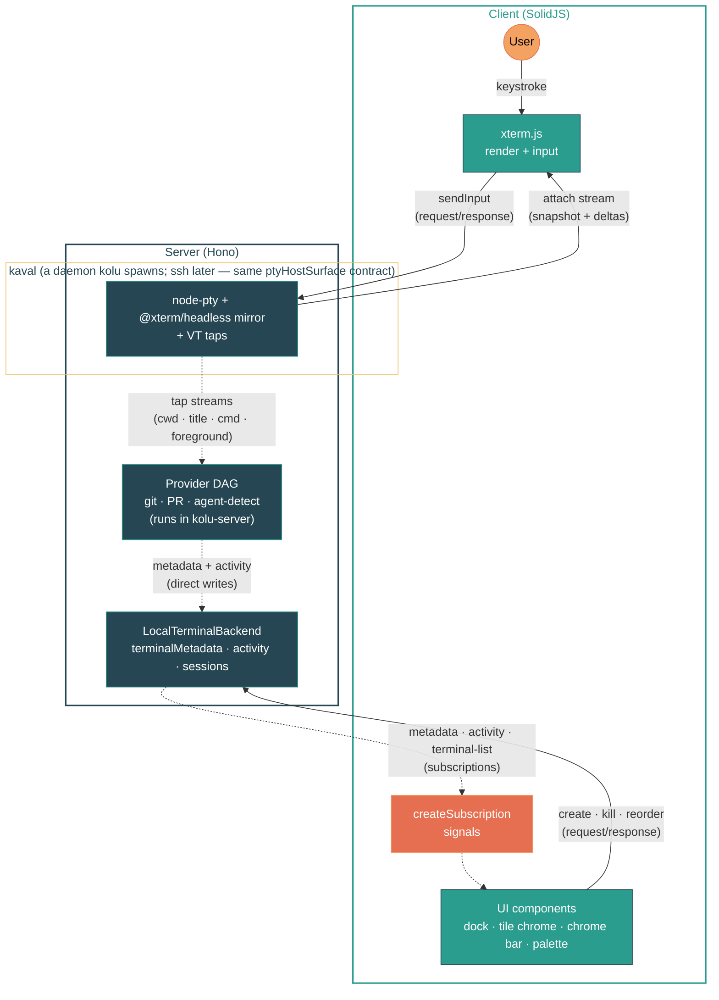

<p align="center">
  
</p>

# kolu

kolu is a terminal app built for scale: real `xterm.js` tiles on an infinite 2D canvas, with a dock that never loses one — for `claude`, `codex`, `opencode`, or anything you run in a shell, especially many at once.

Unlike agent command centers that wrap a single model behind their own chat UI, kolu stays out of the agent's way: the terminal is the universal interface, so `claude`, `opencode`, or whatever ships next week works out of the box — and you can drop to a plain shell whenever you want. Kolu treats terminals as the thesis, not the substrate.

## Philosophy

Two principles shape what kolu is and isn't:

**Agent-agnostic.** The terminal is the universal interface. Kolu doesn't wrap a specific model or lock you into one CLI — `claude`, `opencode`, or whatever ships next week all work the same way, because they're just programs you run in a shell. There's no agent registry to update, no adapter to write, no vendor lock-in. Any new agent CLI picks up first-class features automatically: run it once in any kolu terminal and the next time you create a worktree, it appears in the sub-palette as a launch option — no configuration, no per-agent code. You can always drop to a plain shell without leaving the app.

**Auto-detected, zero setup.** Kolu populates its UI by watching what you already do — the repos you `cd` into, the agents you run, the sessions you save — not by asking you to configure it. Recent repos track `cd` events, branch / PR / CI status derive from the terminal's CWD, Claude Code state is read from the foreground pid, and recent agent CLIs come from preexec command marks emitted by kolu's shell integration. If kolu knows something, it's because the shell already told it. The surface grows with your workflow, not with a preferences pane.

## Usage

[Install Nix](https://nixos.asia/en/install) and then run:

The same command runs kolu and updates it — `--refresh` busts Nix's flake cache so you always pull the latest commit:

```sh
nix --refresh run github:juspay/kolu       # serve on 127.0.0.1:7681
nix --refresh run github:juspay/kolu -- --host 0.0.0.0 --port 8080  # expose on LAN
```

Open http://127.0.0.1:7681 (or the address you chose above).

## Features

### Terminals

- Create, switch, and kill terminals — every terminal renders as a draggable tile on the canvas, with the left-edge **dock** as the canonical at-a-glance navigator (rail / cards levels) and the **command palette** as the canonical search surface
- Split terminals — <kbd>Ctrl+&#96;</kbd> splits a bottom pane per terminal; <kbd>Ctrl+Shift+&#96;</kbd> adds tabs, <kbd>Ctrl+PageDown</kbd> / <kbd>Ctrl+PageUp</kbd> cycles. Open splits surface as an inline `▭ N` chip on the parent's dock row so the count is visible at a glance, not just on the active tile's title bar
- Font zoom (<kbd>Cmd/Ctrl</kbd> <kbd>+</kbd>/<kbd>-</kbd>), persisted per terminal across sessions
- WebGL rendering with canvas fallback, clickable URLs, Unicode 11, inline images (sixel, iTerm2, kitty)
- Clickable file references — terminal output that contains `path/to/file.ts:42` (with optional `:col` or `-end` line range) is linkified; clicking opens the file in the right panel's Code tab at that line
- The right panel opens by default on desktop for new users, landing on the **Code** tab's **All files** repo browser — an editor-like (Zed/VSCode) first surface that always has a populated tree, rather than a diff view that reads empty on a clean tree. Code leads the tab row; toggle the whole panel with the chrome-bar inspector button or <kbd>Cmd/Ctrl</kbd>+<kbd>Alt</kbd>+<kbd>B</kbd>. The open/collapsed state, active tab, and code mode all persist, so anyone who tunes them keeps their choice. (On mobile the panel hosts as a bottom drawer that stays closed until you tap the chrome-sheet inspector toggle — but it still defaults to the same Code / All-files surface once opened.)
- Lazy attach — late-joining clients receive serialized screen state (~4KB) instead of replaying raw buffer
- Mobile key bar — on coarse-pointer devices, a two-row bar above the terminal sends the keys soft keyboards lack (<kbd>Esc</kbd>, <kbd>Tab</kbd>, arrows, <kbd>Ctrl+C</kbd>) plus an IME-bypassing <kbd>Enter</kbd> for Android chat keyboards, with a haptic tick on every tap. The twelve soft keys lay out in a six-column grid — two rows of six — so every key is visible at once, with no horizontal scrolling. Two sticky modifiers (<kbd>Ctrl</kbd>, <kbd>Alt</kbd>) arm one-shot: tap to arm, then the next character — typed on the soft keyboard or sent from the bar — folds into the chord (e.g. <kbd>Ctrl</kbd>+<kbd>R</kbd>, <kbd>Alt</kbd>+<kbd>F</kbd>) and disarms. Touch-swipe inside the terminal scrolls the scrollback buffer

### Navigation

- Command palette (<kbd>Cmd/Ctrl+K</kbd>) — search terminals, switch themes, run actions
- Worktree-naming flow — drilling into `New terminal → <recent repo>` opens a leaf with the worktree name pre-filled (random ADJ-NOUN, auto-selected) and an agent picker below; type a custom name and hit Enter to land in a freshly-branched worktree, or pick an agent to launch it in one step. The typed name becomes the branch name and surfaces verbatim on the dock row, so worktrees stay identifiable at a glance
- Agent-aware command palette — once you've run a known agent CLI (`claude`, `aider`, `opencode`, `codex`, `goose`, `gemini`, `cursor-agent`) in any kolu terminal, it surfaces in two places: as a row in the worktree-naming leaf above (so the same Enter creates the worktree and launches the agent), and as the root-level `Recent agents` group under the **Active Terminal** section as a prefill-into-active-terminal affordance. Prompt/message flag values (`-p`/`--prompt`/`-m`/`--message`) are stripped before storage so ephemeral prompt text never lands in the persisted MRU
- Dock pings — when an agent finishes in the background with an unread completion, the dock row's state pip switches to a loud pulsing violet disk with a halo so you can spot it without panning. Once you activate the row the urgency drops — the pip falls back to a quiet dim dot if the agent's still technically awaiting, or whatever its current bucket says — so a row you've already glanced at doesn't keep yanking the eye. A simultaneous toast names the terminal that finished and carries a **Switch** action that pans the canvas to it; when kolu is in the background (a hidden tab or an installed PWA window that isn't focused) an OS notification does the same on click. <kbd>Ctrl+Tab</kbd> (or <kbd>Alt+Tab</kbd>) cycles terminals in MRU order: hold the modifier, press Tab to advance, release to commit
- Keyboard-driven — <kbd>Cmd+T</kbd> new terminal, <kbd>Cmd+1</kbd>…<kbd>Cmd+9</kbd> jump, <kbd>Cmd+Shift+[</kbd> / <kbd>Cmd+Shift+]</kbd> cycle, <kbd>Cmd+Shift+M</kbd> maximize, <kbd>Cmd+/</kbd> shortcuts help

### Canvas workspace

The desktop workspace is mode-less — every terminal renders as a draggable, resizable tile on an infinite 2D canvas. Per-terminal chrome (theme pill, agent indicator, screenshot, split toggle, find) lives on each tile's title bar. A transparent **chrome bar** floats at the top carrying logo, a **build/commit identity rail** (an `srv` connection + version readout whose commit links to its GitHub source, beside a `client` column carrying the browser bundle's own build commit — when the two clean commits disagree, the signature of a cached old bundle against a freshly deployed server, the rail flags the mismatch with a `≠ srv` badge and a reload hint; a **kaval** column carries the terminal daemon's live health dot and uptime), command palette, settings, and the maximize / dock / inspector toggles; the canvas grid reads through it. The left edge hosts the **dock** — the canonical live-terminal navigator. When the inspector panel opens, the chrome bar shrinks its right edge to the panel's left so the controls cluster stops short of the panel. When a tile is maximized, the chrome bar docks above and the dock renders as a flush left sidebar so the maximized terminal reflows next to it.

- **Infinite pan & zoom** — two-finger scroll / trackpad to pan, pinch or <kbd>Ctrl+scroll</kbd> to zoom. Hold <kbd>Shift</kbd> to force pan even with the cursor over a terminal tile (hand-tool style). No boundaries — the canvas extends freely in every direction via CSS `transform: translate() scale()` (Figma/Excalidraw model)
- **Snap-to-grid** — tiles snap to a 24px grid on drag and resize for tidy layouts
- **Maximize a tile** — double-click any tile's title bar (or click the maximize button on the tile, or the maximize toggle in the chrome bar, or press <kbd>Cmd+Shift+M</kbd>, or run "Maximize terminal" from the command palette) to fill the viewport; the maximized posture persists across reload via localStorage so you land back where you left off
- **Dock — two-level navigator** — the left-edge dock is the canonical live-terminal surface, with two progressive levels of detail (#903):
  - **Rail** — a 44 px-wide strip of 32 px chips, one per terminal. Each chip carries two glyphs (first alpha char of the repo + the intent's lead grapheme, falling back to the first alpha char of the branch tail) so two terminals in the same repo stay distinguishable — `Kf` is kolu/feat-dock-bare, `Kr` is kolu/remote-talk, and an intent like `🛟 FLOAT/right` chips as `K🛟` so the recognition cue cards mode shows survives at rail width. Repo color tints the chip's bg and ring; bucket state animates the ring (breath in `alert` for awaiting, accent spin-glow for working); active wears a 2 px accent halo; unread shows a pulsing alert badge at the corner. Tiny tinted repo dividers between adjacent chips from different repos carry the cards-mode section-header color into the rail.
  - **Cards** (default) — rows grouped by repo. Each repo gets a banded section header (uppercase name + repo-color swatch + row count); rows below stack as `state · branch · pips · time` lines. The first-column **state pip** encodes one thing: how urgent is this row? Shape carries the answer — a filled violet disk with a pulsing halo for **needs attention** (unread fresh background transition), a quiet dim violet dot for **awaiting** that you've already seen and let linger, a hollow spinning teal ring for **working**, a tiny muted dot for **idle**, empty for **none**. The violet "your turn" hue sits deliberately outside the warm/pending family (the CI-checks pip stays amber) so an agent waiting on you never reads as a build still churning. Different shapes (not just different colors) so the distinction survives reduced color sensitivity and peripheral glance. The same state pip now also leads the terminal title bar's branch/intent line (beside the same intent context it sits next to on the dock row) — tracking the *live* agent state (spinning ring = working, dot = awaiting), and, like the title's agent-kind indicator, showing nothing once no agent is attached — and labels each agent-state column header in the workspace switcher. One shape vocabulary, reused verbatim, so a working or awaiting agent reads identically across dock, title, and switcher; the dock's extra idle/parked triage states (which fold in recency/staleness) stay dock-only. Agent kind (Claude / Codex / OpenCode) is not surfaced on the dock row — that identity lives on the terminal title bar where there's room. PR pip is a link to the PR with the live checks verdict + per-check list in its tooltip; the sub-terminal chip surfaces when there are nested terminals. The active row gets a quiet highlight (`bg-accent/15` + 3 px accent left-edge stripe); row geometry stays constant so the dock never reflows when the active terminal changes. Pip columns share a CSS subgrid across each section, so a column whose rows all lack a pip collapses to 0 width — branch labels get every pixel the icons aren't using.

  Workspace search lives in the unified **command palette** (#912): the dock's search-icon button (and <kbd>Cmd+Shift+K</kbd>) opens the palette pre-drilled into the "Search workspaces" group. The group renders its own body inside the palette — a repo-facet sidebar plus agent-state columns (`Idle`, `Awaiting you`, `Working`, `No agent`) — each column header labelled with its agent-state pip (the spinning ring on `Working`, a quiet dot on `Awaiting`/`Idle`) — with the `Idle` column sub-grouped by age (`4–12h`, `12–24h`, `24–48h`, `48h+`) the same way the minimap window picker shows it. The palette input drives an AND-token query across 20+ metadata fields; the body filters the visible cards live.

  Ordering is **pure recency at every layer** — the repo whose newest row just changed floats up, and within a repo the rows sort the same way. The bucket no longer promotes a row's position; "needs attention" is carried by the pip's pulse and color, not by where the row sits in the list. Rows are still clustered by branch/intent label so two terminals on the same branch stay adjacent — the cluster headline uses the same recency key, so clustering keeps siblings together without re-ordering the whole list. Click any dock row or palette workspace card to focus and center its tile. In maximized-tile mode the dock renders as an opaque flush-left sidebar and the maximized terminal reflows next to it (#904); in tiled mode the dock floats over the canvas as an equally opaque card so tiles never bleed through the seams. The dock stays mounted even on the empty canvas (desktop), where it collapses to its header so the `+` new-terminal button is always a click away — the first terminal never depends on knowing a keyboard shortcut.
- **Activity window — hard filter, not a dim** — a single per-device choice (`All / 4h / 12h / 24h / 48h`, default `24h`) governs the dock cutoff. Rows past the window disappear from the dock entirely. In cards mode (and the mobile drawer) the dock's bottom strip carries both the disclosure and the picker inline ("`6 hidden by 4h window — show all`"); when nothing is parked it still reads `0 hidden by 4h window` so the control stays reachable, and the "show all" shortcut surfaces only when something is actually hidden. In rail mode the 44 px strip can't hold the sentence, so it collapses to just the centered picker chip — and, when the window is actually hiding rows, a compact accent count stacked above it that doubles as the one-click "show all" recovery button (its accessible label spells out "`N terminals hidden by the activity window — show all`"). The minimap's matching pill drives the same shared signal (via the same `ActivityWindowChip`), so tightening one tightens the other. The canvas tile fades, the hidden terminal stops counting toward the OS/PWA dock badge, and any fresh agent transition surfaces it automatically.
- **Minimap heatmap** — the canvas minimap dots any tile whose agent is currently `waiting` (alert color) or `thinking`/`tool_use` (accent color), suppressed once the tile falls outside the activity window, so you can scan a 20-tile workspace for "who needs me" or "who is making progress" without opening the switcher. Tiles outside the window collapse to small ghost markers so visual weight shifts onto what's still in play.
- **Identity-collision suffix** — when two terminals share the same repo+branch (or cwd, for non-git), the server assigns each a stable 4-char id suffix (`#a3f2`) so the dock and tile chrome can disambiguate them at a glance
- **Canvas navigation** — the command palette can center the active tile when panning has moved it out of view, or arrange the canvas by repo to cluster each repo's tiles into a square-ish island while preserving every tile's current size. Arranging is a one-shot, explicit action: a new terminal opens at the viewport without rearranging anything, so the tiles you've already placed stay exactly where you put them — clustering happens only when you run "Arrange canvas by repo"
- **Per-tile theming** — title bars and pill swatches derive their colors from each terminal's theme for guaranteed contrast
- **Mobile** — the canvas, pan/zoom, and the desktop dock are disabled; the active tile fills the viewport and swipe-left/right cycles between terminals in compact switcher order. Switching or revealing a tile never raises the soft keyboard — it appears only when you tap the terminal, so it stays out of the way while you navigate. A pull-down chrome sheet at the top reveals the same logo + vertical switcher list + controls as a touch-sized drawer. The right panel — Code + Inspector tabs, file tree, HTML/SVG/PDF iframe + image + video preview — hosts as a **bottom drawer** instead of a side split, mounting the same `RightPanel` → `CodeTab` subtree as desktop; tap the inspector toggle in the chrome sheet (or a `path:line` link in terminal output) to open it

### Git & GitHub

- Auto-detected repo name, branch, and working directory (via OSC 7 + `.git/HEAD` watcher)
- GitHub PR detection — shows the merge-state icon (open / merged / closed), CI check status dot (pass/pending/fail), `#N`, and PR title on the tile chrome, the inspector, **the dock row, and the workspace-switcher card** so the merge state is visible from every navigator surface without focusing the tile
- Per-repo color coding on the dock, tile chrome, canvas tile border, and minimap via golden-angle hue spacing — the same hue echoes across every surface so a repo reads as one identity at a glance
- Git-status indicators across the Code tab's **All files** view — every file in the full-repo browse tree carries the same change color the Local and Branch modes show (modified / added / untracked / renamed / deleted), so you can see what's touched without leaving whole-repo browsing, and **every ancestor folder of a change is tinted in the modified color** (not just Pierre's faint roll-up dot) so a changed subtree reads at a glance. The decoration overlays the **working-tree** status (primary) on the **branch-vs-base** status (fallback), so an uncommitted edit wins over a change committed earlier on the branch, while a file the branch changed but you haven't touched still shows via the branch layer. The branch layer is best-effort: a repo whose `origin/<default>` simply isn't fetched yet falls back to the working-tree layer rather than erroring (the explicit Branch *mode* still surfaces that as an actionable "run git fetch" message), while a remote-less repo with no `origin` at all has no base to compare and degrades to an empty Branch view instead of erroring on every change tick (#1244). The folder tint rides a small shadow-root style injected into the Pierre tree, since Pierre exposes no theme variable for it
- Inline preview of agent-generated `.html` / `.svg` / `.pdf` artifacts — selecting one in the Code tab's browse mode renders it in a sandboxed iframe (`sandbox="allow-scripts"`, no `allow-same-origin` — page scripts run in an opaque origin and can't touch Kolu's cookies/localStorage; cross-origin `fetch()` from inside is blocked, which is fine for static artifacts) served from a per-terminal route under the terminal's repo root. Raster images (`.png` / `.jpg` / `.gif` / `.webp` / `.ico`) are served by the same route but presented with a plain `` centered on a checkerboard, so transparency reads against the dark panel — no script sandbox needed since image bytes can't execute. Video files (`.mp4` / `.m4v` / `.webm` / `.mov` / `.ogv`) render in a native `<video controls>` element; the route answers HTTP range requests (`Accept-Ranges` + `206 Partial Content`) so the player can seek and plays even in browsers (Safari) that refuse media a server can't range-serve. Image, video, and iframe previews all live-reload when the file changes (mtime bump on the URL) via the same `fsReadFile` subscription path as text. Clicking an `<a>` link between previewed HTML files follows through: the in-iframe `@kolu/artifact-sdk` reports the loaded document's path back out (the opaque-origin sandbox blocks the parent from reading it directly), so the file tree selection moves to the linked file as you navigate. An **external** link (one that resolves to a different host over http(s)) can't escape the `allow-scripts`-only sandbox on its own — `target="_blank"` is blocked and a plain click would replace the preview in-pane — so the in-iframe SDK traps the click and forwards the absolute URL, and the host opens it in a real browser tab (severed opener) while the preview stays put; the parent re-checks the scheme is http(s) before opening, since `postMessage` is reachable by any in-frame script
- Rendered Markdown with a **Source ⇄ Rendered toggle** — opening a `.md` / `.markdown` file in the Code tab's browse mode renders it as a reading document (via `@kolu/solid-markdown`), not raw source. Full GitHub-Flavored Markdown — headings (with anchor ids), tables, task lists, strikethrough, autolinks, footnotes, and `> [!NOTE]`-style alerts — plus the inline HTML a README leans on (`<details>`, `<kbd>`, `<p align>` wrappers, definition lists, figures, images), all sanitized through DOMPurify against a tight Markdown-only allowlist — scripts, inline `style`/`class`, SVG/MathML, and form controls are all stripped, so a previewed document can neither script nor restyle the app. A leading YAML front-matter block is dropped rather than rendered as a stray heading. External anchors are forced to open in a new tab with a severed opener, while in-page anchors (TOC jumps, footnote refs) scroll within the preview without touching the app's URL, and a **repo-relative link** (`[doc](docs/guide.md)`) opens the target file right in the Code tab — resolved against the document's directory, GitHub-style — instead of navigating the app origin to a broken route. **Obsidian-style wikilinks** (`[[Note]]`, `[[Note|alias]]`, `[[Note#heading]]`) render as a distinct violet, bracketed reference and resolve *pathless* across the whole repo — `[[Architecture]]` opens `Architecture.md` wherever it lives (`.md` implied — never a same-stemmed `Architecture.feature`); an ambiguous basename pops a small disambiguation menu anchored to the link, a miss toasts, and the `![[…]]` embed form is left inert. The styling follows the app's **light/dark** preference automatically (it paints with `currentColor` + the app's accent, so it adapts to either palette), and a repo-relative image resolves against the document's directory and loads from the per-terminal file route — degrading to a labelled chip only when it genuinely can't be resolved. A small segmented toggle in the file header flips to the syntax-highlighted source (for exact syntax, copy, or line-anchored comments) and back; rendered is the default. Markdown stays a text file on the wire (`fsReadFile` `kind:"text"`) — it renders client-side from its own `content`, so the toggle is offered because the file has *both* a source and a rendered form. The same toggle host (`@kolu/solid-fileview`) will later light up for HTML/SVG
- Comments on any file — select text in a source file, a branch diff, a rendered HTML artifact, or the **rendered Markdown preview** and a floating "+ Comment" pill appears next to the selection; click it to attach a free-text note. Comments accumulate in a tray at the bottom of the Code tab across every file in the worktree's repo; "Copy to clipboard" flushes the queue as a plain Markdown list ready to paste into the agent's prompt. Anchors use the W3C TextQuoteSelector model (quote + ±32-char context), so the agent receiving the payload can re-locate the position by grep even after the file is edited. The same anchor model — and the same pure `extractQuote` / `findQuote` functions — powers every surface: the parent-side source/diff view (Pierre's `CodeView`), the light-DOM Markdown preview (anchored against the preview's own subtree), and the in-iframe HTML annotator served by `@kolu/artifact-sdk`. A comment on the rendered Markdown preview carries **no source line** — a rendered line isn't a source line and the quote ("Hello Doc") needn't appear verbatim in source ("# Hello Doc") — so it anchors by quote alone (still grep-locatable); a comment in the source view additionally carries a line range. Comments persist per repo via `localStorage` (keyed by `git repoRoot`, so they survive worktree switches) and render in place via the CSS Custom Highlight API where supported

### Claude Code Status

Detects [Claude Code](https://docs.anthropic.com/en/docs/claude-code) sessions running in any terminal and surfaces their state on the tile's chrome and in the dock.

**What we detect:**

| State                 | Indicator           | Meaning                                                                                                                                                              |
| --------------------- | ------------------- | -------------------------------------------------------------------------------------------------------------------------------------------------------------------- |
| Thinking              | Pulsing accent dot  | API call in flight — Claude is generating a response                                                                                                                 |
| Tool use              | Pulsing yellow dot  | Claude is executing tools                                                                                                                                            |
| Running in background | Spinning working ring | Claude ended its turn while an observable [dynamic workflow](https://code.claude.com/docs/en/workflows) it launched is still running — it is busy-waiting on that task, not awaiting you, so it buckets as *working* rather than *awaiting* and never falsely pings. A detached `Bash` command or background `Task`/`Agent` has no run journal to observe and settles as *waiting* instead |
| Awaiting input        | Pulsing alert       | Claude is blocked on you — an `AskUserQuestion` prompt or a tool-permission gate (Write/Edit/Bash/WebFetch approval). The JSONL tail doesn't reveal the block while it's pending — for `AskUserQuestion` the prompt is buffered off-disk; for a permission gate the tool call is on disk (so the tail reads *tool use*) but the approval decision is screen-only — so kolu recognizes them on the **rendered screen** instead (see below) and buckets it as *awaiting* so the dock pings you. (`ExitPlanMode` is a deliberate follow-up — its prompt carries no equivalent on-screen marker.) |
| Waiting               | Dim dot             | Claude finished responding — or the turn was interrupted with Esc — and is idle, waiting for user input                                                              |

**How it works:** asks each terminal for its current foreground process pid via `tcgetpgrp(fd)` (exposed by node-pty's `foregroundPid` accessor), then checks whether `~/.claude/sessions/<fgpid>.json` exists. If it does, that terminal is running claude-code — we tail the session's JSONL transcript to derive state from the last message. The tail is also scanned for a dynamic `Workflow` the agent launched (one carrying a Run ID, so it has an observable run journal) that hasn't yet reported a terminal status via a `queue-operation` completion; when such a run is outstanding *and* its journal is still observably live (written within a couple of minutes, non-terminal), a bare end-of-turn is promoted from *waiting* to *running in background* so a busy-waiting agent doesn't read as needing you. A detached `Bash` command or background `Task`/`Agent` is deliberately *not* promoted — kolu has no journal to confirm it's still alive, and its launch marker outlives the process, so reading it as working would spin the ring forever after a Claude restart. An interrupted turn (Esc) appends a trailing `user` entry carrying an explicit interrupt marker (`[Request interrupted by user]`, or an errored `tool_result` for a mid-tool-call Esc); that marker reads as *waiting* (idle), not *thinking* — so the dock settles instead of animating a phantom spinner that persists across `claude -c`. Cross-platform (Linux + macOS) since `tcgetpgrp` is POSIX. One state the JSONL tail *can't* carry is `awaiting_user`: for `AskUserQuestion` / `ExitPlanMode` Claude's SDK buffers the assistant message in memory and flushes the transcript only after you answer (the tail reads the prior entry — often *thinking*, sometimes *waiting*); for a tool-permission gate the tool call is on disk (the tail reads *tool use*) but the approval decision is screen-only. kolu recovers it by **scraping the rendered screen** — whenever a session sits in a pollable JSONL-derived state (*thinking*, *tool use*, or *waiting*), the server polls that terminal's VT-resolved screen text (`@xterm/headless` mirror, read server-side via `getScreenText`, so it works for background tiles, mobile, and remote/SSH PTYs alike) on a ~1 s clock and matches a small set of framework-rendered markers (captured live from claude-code v2.1.162): `AskUserQuestion`'s `… to navigate · Esc to cancel` footer (covering both the single-select and multi-select/tabbed shapes), the edit-family permission gate's full `Esc to cancel · Tab to amend` footer, and the other permission gates' (`Bash`/`WebFetch`/…) numbered `<n>. Yes, and don't ask again for …` remember-option line. Each is *chrome* the framework draws, not model-supplied text, so it survives option-label churn — and each is anchored on its full surrounding structure (whole footer / whole numbered option line), so neither a look-alike menu nor the bare words in ordinary output false-promote: Claude's own `/fork` agent list uses `↑/↓ to select` ("select", not "navigate"), the `/model` and folder-trust pickers end in "Esc to cancel" but not via "to navigate", and the slash menu has none. The surface is deliberately a handful of high-confidence markers we grow over time; `ExitPlanMode` (whose prompt has no equivalent footer) and the hook-based path are follow-ups. A match promotes the active pollable state → *awaiting input*; when the prompt clears, the same poll republishes the raw JSONL-derived state (the JSONL watcher's change gate would otherwise silently drop the structurally-identical settle-back, so the watcher itself can't demote it — the poll self-demotes instead). The signature is pure and centralized in `claude-code/src/screen.ts`, and the scrape is just another *source* for the already-wired `awaiting_user` state — no client change. Each card also surfaces the session's display title (custom title › auto-generated summary › first prompt) via the [Claude Agent SDK](https://platform.claude.com/docs/en/api/agent-sdk/typescript)'s `getSessionInfo()`, refreshed best-effort on each transcript change. The tile chrome also shows a running token count (compact, e.g. `47K`) summed from the latest assistant entry's `message.usage` — `input_tokens + cache_creation_input_tokens + cache_read_input_tokens`. Raw count only; window size isn't inferable from the JSONL (1M beta strips its suffix, so a `%` would lie), and the raw number is the useful signal anyway.

**What we can't detect:**

- **`ExitPlanMode` (plan-approval)** — `AskUserQuestion` and the tool-permission gates are surfaced as *awaiting input* (via the screen scrape above, #905), but the plan-approval dialog has a distinct on-screen shape (`Ready to code?`, no arrow-nav footer) and would need its own, more volatile literal added to `screen.ts` — a deliberate follow-up, kept out for now to keep the detection surface small and high-confidence
- **Streaming progress** — intermediate thinking tokens aren't tracked, only final state transitions
- **Wrapped invocations** — if claude-code is launched via a wrapper (e.g. `script -q out.log claude`), the foreground pid is the wrapper, not claude itself, so the session lookup misses
- **Sub-agents** — individual nested agent spawns aren't tracked as separate sessions. When the parent ends its turn to wait on a launched _dynamic workflow_, though, Kolu surfaces that workflow's fan-out — its name and live sub-agent count, read from the run journal at `<session>/workflows/<runId>.json` — on the tile chrome and inspector while the parent is `running in background`

**Debugging detection:** the command palette has a `Debug → Show Claude transcript` entry (visible only when the active terminal has a Claude session) that opens a side-by-side view of the server's state-change log next to the raw JSONL events from disk since monitoring began. Use it when state seems stuck or transitions feel missed.

### Codex Status

Detects [Codex](https://github.com/openai/codex) TUI sessions and surfaces their state alongside Claude Code and OpenCode.

**How it works:** when the foreground process is `codex`, the provider queries Codex's threads SQLite DB (highest-numbered `~/.codex/state_<N>.sqlite`, auto-discovered on startup) to find the most recently updated non-archived `cli` thread whose `cwd` matches the terminal's CWD. Thread metadata (title, model) comes straight from indexed columns. The running context-token count and the agent state (thinking / tool*use / waiting) both come from tailing the per-thread rollout JSONL at `threads.rollout_path`: `state` from pattern-matching `task_started` / `task_complete` / `function_call` / `function_call_output` events, and `contextTokens` from reading `info.last_token_usage.input_tokens` on the latest `token_count` event — the same number Codex's own `/status` command displays. Live updates come from `fs.watch` on the SQLite WAL file (`state*<N>.sqlite-wal`); Codex writes the WAL and appends the JSONL in the same cycle (verified: nanosecond-identical mtimes), so one signal covers both sources.

**Why `last_token_usage.input_tokens` alone, not a sum?** Claude-code sums three input-side fields (`input_tokens + cache_creation + cache_read`) because Anthropic's schema makes them disjoint buckets. OpenAI's schema — which Codex emits — is different: `input_tokens` is _already_ the full prompt, and `cached_input_tokens` is a breakdown of what portion was a cache hit, not an additional count. Adding them double-counts every cache re-read. The field as-is is what `/status` reports and what gives users an accurate read on context pressure.

**Why not `threads.tokens_used`?** That column holds the session-lifetime cumulative total (`total_token_usage.total_tokens` summed across every turn). For long-running sessions it climbs into tens of millions — misleading as "how close am I to exhausting the 258 K context window."

**Why both SQLite and JSONL?** SQLite alone gives us title and model cheaply from indexed columns — no file read, no parsing. JSONL alone would force re-parsing the entire file on every update to recover title. Neither source alone carries both the event stream that drives state AND the per-turn token usage AND the columns that drive metadata — combining them specializes by purpose.

**What we detect:**

| State          | Indicator          | How                                                                                                                                                          |
| -------------- | ------------------ | ------------------------------------------------------------------------------------------------------------------------------------------------------------ |
| Thinking       | Pulsing accent dot | Latest lifecycle event is `task_started`, with no open `function_call` scoped to the current turn                                                                                                                              |
| Tool use       | Spinning yellow    | Latest lifecycle event is `task_started`, with at least one open `function_call` that isn't a known awaiting-user tool                                                                                                         |
| Awaiting input | Pulsing alert      | Every open `function_call` names a known awaiting-user tool — `request_user_input` (Plan mode), `request_permissions` (all modes), or `request_plugin_install`. Codex is blocked on the user, not running compute |
| Waiting        | Dim dot            | Latest lifecycle event is `task_complete`                                                                                                                                                                                      |

Open-call tracking is scoped per-turn: a `function_call` with no matching `_output` that straddles a `task_started` boundary (user aborted a prior tool-using turn) does not pin the next turn to `tool_use`.

**What we can't detect (yet):**

- **Task-progress checklist** — Codex has no TodoWrite equivalent (`task_started`/`task_complete` are per-turn lifecycle, not user-visible checklists), so the `taskProgress` field stays permanently null
- **Column-level schema changes** — the filename version is auto-discovered, but if upstream renames or removes a depended-on column in the `threads` table (e.g. `rollout_path`, `cwd`, `source`, `archived`), session detection silently returns zero matches. Set `KOLU_CODEX_DB` to pin a known-good DB while a fix ships
- **Same-directory disambiguation** — if multiple Codex threads share a cwd, we pick the most recently updated one (same heuristic as OpenCode)
- **Sub-agent threads** — Codex's spawned sub-agents get `source = '{"subagent":…}'` rows in the same table; we filter them out (they have no foreground terminal to bind to)

### OpenCode Status

Detects [OpenCode](https://github.com/anomalyco/opencode) sessions and shows their state alongside Claude Code on the tile chrome.

**How it works:** when the foreground process is `opencode`, the provider queries OpenCode's SQLite database directly at `~/.local/share/opencode/opencode.db` to find the most recently updated session whose `directory` matches the terminal's CWD. State is derived from the latest message: a user message means the assistant is _thinking_; an assistant message with `time.completed` set and `finish: "stop"` means _waiting_; otherwise still _thinking_. Todo progress comes from a `COUNT(*)` over the `todo` table — much simpler than Claude Code's tool-call parsing since OpenCode stores todos as first-class rows with a `status` column. The tile chrome also shows the running token count from the latest assistant message's `tokens.total` (pre-summed by OpenCode — we pass it through). Live updates come from `fs.watch` on the SQLite WAL file (`opencode.db-wal`), which OpenCode writes to on every database mutation.

**Why SQLite, not REST?** The OpenCode TUI doesn't expose an HTTP server by default — that's a separate `opencode serve` mode. Reading the SQLite DB directly works against the actual TUI users run, with no port discovery and no extra processes. SQLite WAL mode allows concurrent readers while OpenCode is writing, so we can open the DB read-only without blocking it.

**What we detect:**

| State          | Indicator          | How                                                                                                          |
| -------------- | ------------------ | ------------------------------------------------------------------------------------------------------------ |
| Thinking       | Pulsing accent dot | Latest assistant message has no `time.completed`                                                                                                   |
| Tool use       | Spinning yellow    | Thinking + at least one `part` with `state.status: "running"` whose `tool` field is neither `question` nor `plan_exit`                             |
| Awaiting input | Pulsing alert      | Thinking + every running `part`'s `tool` is `question` (structured prompt) or `plan_exit` (plan-mode approval gate) — blocked on a human reply     |
| Waiting        | Dim dot            | Latest assistant message has `time.completed` set and `finish: "stop"`                                                                             |

**What we can't detect (yet):**

- **Same-directory disambiguation** — if multiple OpenCode sessions share a working directory, we pick the most recently updated one
- **Non-default DB location** — set `KOLU_OPENCODE_DB` to override the path

### Theming

- 200+ color schemes from [iTerm2-Color-Schemes](https://github.com/mbadolato/iTerm2-Color-Schemes), switchable at runtime
- Live preview while browsing themes in the palette
- Shuffle theme — new terminals (and the active one on <kbd>⌘J</kbd>) get a background perceptually distinct from every other open terminal (toggleable; on by default)
- Dark / light / system UI theme
- Installed PWA chrome color derives from the server hostname, so app windows from different machines are easier to distinguish
- **Welcome for new users** — the empty canvas shows three bird's-eye moments (pin kolu as an app · reach it remotely via Tailscale · run agents), above session restore and re-openable anytime via the command palette's **Tutorial** command. The "pin it" card is context-aware: over plain `http://` (a LAN/Tailscale IP, where browsers can't install a PWA without a secure context) it points you to the Tailscale HTTPS fix instead of a dead Install button. Full guide at [kolu.dev](https://kolu.dev)

### Clipboard

- <kbd>Ctrl+V</kbd> pastes images into any agent that accepts paste-as-file-path (Claude Code, codex, …) — the server saves the browser's clipboard image and bracketed-pastes its path into the PTY
- **Drag-and-drop files** onto a terminal — the file uploads to the server (10 MB cap, curated extension allowlist covering text, code, structured data, common docs, and images) and its path is bracketed-pasted into the PTY just like a clipboard image, so agents that accept paste-as-file-path pick it up automatically. Disallowed types and oversize drops are rejected client-side with a toast and never hit the wire

### Screen recording

Record the Kolu tab — whole canvas or a single maximized terminal — with microphone and optional webcam PiP, straight to a local `.webm` file. Chromium-only (uses the File System Access API).

- **One-click setup popover** — mic picker with live 8-segment RMS level meter, webcam toggle + device picker + circular preview, all in a compact popover anchored to the chrome-bar record button
- **Streaming to disk** — chunks flow from `MediaRecorder` into a `FileSystemWritableFileStream` continuously, so memory stays flat regardless of recording length. A partial `.webm` survives a browser crash (recoverable with ffmpeg)
- **Duration-fix pass** — Chrome's `MediaRecorder` omits the WebM `SegmentInfo.Duration` header in streaming mode, which makes players show a ~1 second duration. At stop, the saved file is read back, patched via [`fix-webm-duration`](https://github.com/yusitnikov/fix-webm-duration), and rewritten
- **Pause / resume** — <kbd>⌘⇧.</kbd> toggles; the segmented recording capsule in the chrome bar shifts red → amber and the breathing halo suppresses while paused
- **Webcam PiP overlay** — when enabled, a circular mirrored `<video>` pins to the bottom-right above maximized tiles but below the chrome bar, and is baked into the recording by the tab-capture stream (no offscreen compositing)
- **Browser picker collapses** — `getDisplayMedia({ preferCurrentTab: true, selfBrowserSurface: "include" })` turns the multi-surface picker into a single "Share this tab" confirmation

### Transcript export

Command-palette entry "Export agent session as HTML" (visible only when the active terminal has an agent session) saves the current Claude Code, OpenCode, or Codex transcript as a single self-contained `.html` file — no external assets, no server upload, opens in any browser offline.

- **Vendor-neutral IR** — each integration loader normalizes its session storage (Claude's JSONL, OpenCode's SQLite, Codex's rollout) into the same `TranscriptEvent` union in `kolu-transcript-core`. The renderer dispatches on `event.kind`, never on the agent — adding a new vendor's quirky tool name is a loader-side change with zero renderer churn
- **Typed `ToolInput` union** — every Claude Code built-in tool ([34 entries](https://code.claude.com/docs/en/tools-reference): Edit/Bash/Skill/TaskCreate/WebSearch/PowerShell/…) and every OpenCode built-in tool ([13 entries](https://opencode.ai/docs/tools/): edit/bash/todowrite/lsp/question/…) maps to a kind the renderer can specialise on. Anything we haven't modelled lands honestly in `kind: "unknown"` with the original `toolName` preserved — the document never lies about what a tool was
- **Code surfaces through Pierre** — `Edit`, `Write`, fenced markdown code, and Codex `apply_patch` all flow through [`@pierre/diffs`](https://www.npmjs.com/package/@pierre/diffs)'s SSR. Each chunk hydrates into a `<diffs-container>` custom element; a tiny inlined bootstrap shares Pierre's ~43KB core stylesheet across every chunk via `adoptedStyleSheets` so the per-event payload stays small
- **Warm-parchment editorial layout** — serif prose, mono code, role-tinted gutters, sticky dock for hide-tools / hide-reasoning / theme cycle, `j`/`k` to step between prompts, Reddit-style indent for nested subtask blocks
- **Theme follows the toggle** — manual dark/light flip flows through to Pierre's shiki tokens via `color-scheme: inherit !important` on `<diffs-container>`, so the whole document (chrome + code) flips together instead of Pierre staying in the system-preferred mode

## Architecture

pnpm monorepo:

| Package                              | Stack                                                                                                                                                                 |
| ------------------------------------ | --------------------------------------------------------------------------------------------------------------------------------------------------------------------- |
| `packages/common/`                   | [oRPC](https://orpc.dev/) contract + [Zod](https://zod.dev/) schemas + cell descriptors                                                                               |
| `packages/surface/`                  | Reactive state framework — typed `Cell<T>`, `Collection<K,T>`, `Stream<I,T>`, `Event<I,T>` over oRPC streams; SolidJS hooks (`useCell`, `useCollection`, `useStream`, `useEvent`)               |
| `packages/surface-nix-host/`         | Runs a typed `@kolu/surface` agent on a remote machine over `ssh`, with Nix as the provisioning mechanism — host-session lifecycle, `nix copy` provisioning, remote-collection mirroring, and reconnect handling. Backs the future `RemoteTerminalBackend` (terminals on SSH hosts) |
| `packages/solid-pierre/`             | Solid-native wrappers around [`@pierre/trees`](https://www.npmjs.com/package/@pierre/trees) and [`@pierre/diffs`](https://www.npmjs.com/package/@pierre/diffs); encapsulates Pierre's imperative mount/render lifecycle behind `<FileTree>` and `<CodeView>` with required `onError` props. `<CodeView>` (Pierre's 1.2.x advanced-mode viewport) hosts files and/or diffs in one virtualized scroll — windowed-rendering is unconditional, so single-file callers ride the same path as future multi-file ones |
| `packages/solid-markdown/`           | App-agnostic safe Markdown → SolidJS renderer: [`marked`](https://marked.js.org/) (GFM + `marked-footnote` / `marked-alert` / `marked-gfm-heading-id`, plus a front-matter strip) parses to HTML (`render.ts`, kept DOM-free + unit-tested, purely structural — it emits marked's default anchors/images and applies no link/image policy), then [DOMPurify](https://github.com/cure53/DOMPurify) sanitizes it (`sanitize.ts`) against a tight Markdown-only allowlist — namespacing every id so a document's anchors can't collide with the app's, and applying an injected `resolveImageSrc` so a repo-relative image loads from the host's file route — (no inline `style`/`class`, SVG/MathML, or form controls) and owns the whole link policy (`safeHref` allowlist; a repo-relative href is tagged for in-app interception so the host opens it in the Code tab, a genuine external href gets new-tab/severed-opener) over *every* anchor, markdown- or inline-HTML-sourced alike — plus an Obsidian-style `[[wikilink]]` inline extension (`markedWikilink`) that mints a distinct `data-md-wikilink` anchor the host resolves pathless across the repo (the document variant only) — so real inline HTML renders (not escaped) while scripts/styles/frames are stripped and links can't hijack the tab. The raw-HTML + image surface is scoped per variant: only `document` (the full-pane preview) gets it; the `inline` / `compact` intent variants keep the stricter scope (no raw block HTML or images), since those are clickable UI rows rendering user/agent text. The output drops into a themed `.kolu-md` container (`markdown.css`, `currentColor` + `color-mix` so it follows light/dark with no theme prop). One `<Markdown>` component with `inline` / `compact` / `document` variants bundling parse mode + styling scale. Kolu's intent surface consumes it, and the `document` variant backs the Code-tab's Markdown rendered-appliance (`@kolu/solid-fileview/renderers/markdown`) that powers the Source ⇄ Rendered preview |
| `packages/solid-fileview/`           | App-agnostic file-preview "outlet". `<FileView>` owns the Source ⇄ Rendered toggle, mode-availability logic (offered iff a file has *both* a source and a rendered form), and the renderer-registry pick — the core has **no rendering dependencies of its own**: the source view and every rendered form are injected `Renderer` values, and each concrete renderer is a separate `/renderers` sub-path appliance. Ships generic `image` / `video` / `iframe` / `markdown` appliances (the `markdown` one wires `@kolu/solid-markdown`). Kolu's Code-tab plugs in pierre-source + markdown + image + video + an iframe wrapped with the artifact-sdk comment bridge, so `right-panel/BrowseFileDispatcher` is a thin `fsReadFile`→`FileView` adapter rather than bespoke render wiring; `.md` now shows the toggle (rendered by default) |
| `packages/serve-dir/`                | App-agnostic `@kolu/serve-dir` — a fetch-native directory file server: `createDirServer(root, realpathGuard?)` returns `fetch(relPath, request) → Response` with streaming HTTP byte-range (`206`/`416`), a complete (`mrmime`-backed) Content-Type table, and a lexical traversal guard. **Zero *workspace* deps** (`node:fs`/`path`/`stream` + the focused `mrmime` MIME table); knows nothing about terminals/git/kolu, so the dependency arrow points *out* (`kolu-server → @kolu/serve-dir`). The consumer injects the absolute root and an optional realpath/symlink guard (kolu-server wires kolu-git's `assertRealpathUnder`), and composes any response transform (the artifact-sdk `<script>` decorator) downstream — which works precisely because `fetch` returns a real `Response` and omits `Content-Length` on full 200s. Backs the Code-tab iframe/image/video preview file route |
| `packages/solid-browser/`            | App-agnostic, framework-free navigation layer for the Code tab — the *browser* that moves *between* documents while `@kolu/solid-fileview` draws each one. Phase 1 (shipped) is pure path/location math with a single workspace dep (`solid-browser → @kolu/solid-markdown/url-policy`); phase 2 adds the `<Browser>` that composes `<FileView>`, extending the acyclic graph to `solid-browser → solid-fileview → solid-markdown`. Ships the pure path math: `resolveRelativePath`/`resolveLinkHref` (GitHub-style relative-ref resolution — resolve against the doc's directory, root-absolute from the repo root, reject own-scheme/`..`-escape) and `pathFromPreviewPathname` (invert a sandboxed iframe's reported `location.pathname` back to a document path, via a host-injected `PreviewPathCodec` so the inversion can't drift from the encoding). Its only dep is `@kolu/solid-markdown/url-policy` (the DOM-free `hasOwnScheme` shape test, shared with the markdown href policy) — zero kolu imports, so the dependency arrow points *out* of the client. The client consumes it from `markdownImageSrc` (which wraps `resolveRelativePath` into a per-terminal file-route URL), `BrowseFileDispatcher` (which calls `resolveLinkHref` before opening a relative link in the Code tab), and `BrowseIframeRenderer` (which binds kolu's `encodePreviewPath`/`decodePreviewPath` codec into `pathFromPreviewPathname`). Phase 2 adds `createBrowser` (location + history) + a `<Browser>` composing `<FileView>` so back/forward falls out for free; see the [solid-browser Atlas note](docs/atlas/dist/solid-browser.html) |
| `packages/artifact-sdk/`             | Self-contained comments-on-files toolkit. Three exports: `./core` (pure W3C TextQuoteSelector functions used by both runtimes), `./client` (parent-side iframe ↔ parent bridge + core re-exports), `./server` (one-line `mountArtifactSdk(app, ...)` that wires the SDK bundle route and an HTML-decoration middleware — esbuild bundles the in-iframe script at server startup, hash-keyed for cache busting). The host server never imports HTML rewriting logic |
| `packages/server/`                   | [Hono](https://hono.dev/); **spawns the `kaval` daemon and is its client** (B2 — the door): at boot it recycles any survivor, spawns a fresh kaval, and connects over kaval's unix socket through the typed `ptyHostSurface` contract, then runs the per-terminal provider DAG fresh in kolu-server against its taps. The server no longer serves a pty-host socket — kaval serves its own, which `kaval-tui` reaches with no flag. `src/ptyHost/` holds the kaval-specific *soul* (`localDriver.ts` — which binary, env, paths) and the composition; the spawn/watch/recycle *spine* is `@kolu/surface-daemon-supervisor` |
| `packages/kaval/`                 | **kaval** — the standalone PTY daemon. The multi-client PTY-owner primitive + its wire contract — [node-pty](https://github.com/microsoft/node-pty) + [@xterm/headless](https://www.npmjs.com/package/@xterm/headless) screen mirror + VT-derived taps (OSC 7 cwd, OSC 0/2 title, OSC 633 command-run, foreground, exit), each fanned out to many consumers via a bounded `Channel`. Owns *only* the PTY; race-free `attach` (snapshot+deltas). `ptyHostSurface` is the typed contract for consuming it, served over kaval's unix socket (`servePtyHostOverUnixSocket`) to both kolu-server and kaval-tui. Its `bin.ts` (B1) makes it a runnable program (`nix run .#kaval`) with zero `kolu-*` deps; kolu-server spawns it as a separate process (B2) |
| `packages/surface-daemon/`           | `@kolu/surface-daemon` — the **daemon half** of the surface-daemon spine: the lifecycle mechanism every long-lived process that owns a unix socket and serves a typed `@kolu/surface` repeats. `acquirePidGate` (the atomic single-instance gate) + `gatePid`/`isHolderLive` (the gate's file-format primitives the supervisor composes) + `daemonMain` (the gate → serve → teardown skeleton, parameterized over scope key, socket path, router, and lifetime). kaval's `bin.ts` is a thin composition over it; `odu serve` is the planned second tenant. Zero `kolu-*` deps; hashed whole into kaval's staleKey (Atlas: `surface-daemon`) |
| `packages/surface-daemon-supervisor/` | `@kolu/surface-daemon-supervisor` — the **supervisor half** of the spine, the mirror that runs in the *client* process (kolu-server). The endpoint state machine (`connecting → connected → degraded → dead`), `waitForPidGone` (the reap-wait), the composed `restart` sequence, and the survivable-spawn driver (the `INVOCATION_ID` gate → `systemd-run --user` / detached fork). Generic over the client + identity; composes the daemon half's gate primitives. Zero `kolu-*` deps and deliberately **not** a staleKey root — it never runs in the daemon (Atlas: `surface-daemon`) |
| `packages/kaval-tui/`                  | `kaval-tui` (beta) — a terminal-side CLI client. Dials kaval's unix socket by default — which now serves kolu-server's terminals too, so `kaval-tui list`/`snapshot`/`attach` reach them with no `--socket` flag — speaks `ptyHostSurface` directly (the *raw* client; the browser is the *rich* one over the full contract), and ships `list` + `snapshot` + `attach` (raw-tty passthrough with an ssh-style line-start `~.` detach — the CLI comes and goes, the daemon keeps the PTY). The second, independent consumer that proves the contract is transport- and consumer-agnostic |
| `packages/terminal-protocol/`        | `@kolu/terminal-protocol` — the VT/device-query protocol policy as a zero-dep leaf: the query-reply suppression grammars (whole-payload predicate for the browser, streaming stripper for the raw tty), the headless forward/drop rule, the answered/silent device-query matrix (as data, executed by pty-host's contract tests), the bracketed-paste delimiters, and the snapshot-reciprocal TTY reset. One home both terminal clients and the server import, so the policy can't drift between them |
| `packages/integrations/pty/`         | Shell-environment prep for PTY spawning — Nix-devshell env filtering, kolu identity vars, and the per-PTY wrapper rc-file that replays user dotfiles and injects kolu's OSC hooks. Callers compose these and hand the result to `kaval`'s `spawn`; Node-stdlib only |
| `packages/client/`                   | [SolidJS](https://www.solidjs.com/) + [xterm.js](https://xtermjs.org/) + [Tailwind CSS v4](https://tailwindcss.com/)                                                  |
| `packages/integrations/claude-code/` | Claude Code detection — JSONL transcript tailing + Claude Agent SDK; exports a `claudeCodeProvider` `AgentProvider`                                                   |
| `packages/integrations/anyagent/`    | Agent-agnostic shared contract (`AgentProvider` interface, `agentInfoEqual`), types (Logger, TaskProgress), and agent CLI parsing                                     |
| `packages/integrations/anyforge/`    | Forge-agnostic PR kernel — `PrInfo`/`PrResult` wire schemas, the `PrProvider` contract (`kind: string` + pure `resolve(git)`; enumerates no forge, mirroring `anyagent`), the generic `subscribePr` poll loop (one injected provider, re-resolving on any `repoRoot`/`branch`/`remoteUrl` change), and the forge-neutral `parseRemoteHost` remote-URL grammar (host out of URL- and scp-shaped remotes; the leaf names no forge). The host→forge mapping itself is a server concern |
| `packages/integrations/codex/`       | Codex detection — reads the highest-numbered `~/.codex/state_<N>.sqlite` for thread metadata and tails the matched rollout JSONL for state; exports a `codexProvider` |
| `packages/integrations/opencode/`    | OpenCode detection — reads OpenCode's SQLite database via Node's built-in `node:sqlite`; exports an `opencodeProvider` `AgentProvider`                                |
| `packages/integrations/git/`         | Pure git operations — `simple-git` wrapper: repo resolution, worktree lifecycle, diff review, path security; schemas re-exported by `kolu-common`                     |
| `packages/integrations/github/`      | GitHub adapter for `anyforge`'s `PrProvider` — `gh pr view` spawn via `KOLU_GH_BIN`, stderr classification (`classifyGhError`), CI-rollup derivation (`deriveCheckStatus`) |
| `packages/integrations/io/`          | Filesystem & I/O primitives — refcounted shared `fs.watch` keyed by directory (`createDirFilenameWatcher`); its only dependency is the types-only `@kolu/log` leaf, so any package can adopt it without runtime coupling |
| `packages/shared/`                   | `kolu-shared` — generic utilities for code that watches live external state on disk (filesystem, SQLite): the `Logger` type re-export, `readTailLines`, and SQLite helpers. No agent-specific concepts; used by `kolu-git` and the agent integrations |
| `packages/transcript-core/`          | Vendor-neutral transcript IR (`Transcript`, `TranscriptEvent`, typed `ToolInput` union) + structural transforms; per-agent loaders normalize into this shape          |
| `packages/transcript-html/`          | Static-export renderer — `marked` for prose, [`@pierre/diffs`](https://www.npmjs.com/package/@pierre/diffs) SSR for shiki-tokenized code/diffs, [Preact](https://preactjs.com/) JSX for chrome; emits one self-contained `.html` |
| `packages/terminal-themes/`          | Terminal color scheme catalog + perceptual-distance picker — themes checked-in as JSON                                                                                |
| `packages/memorable-names/`          | ADJ-NOUN random name generator — word lists checked-in as JSON                                                                                                        |
| `packages/log/`                      | Structured-logging contract (`Logger`) — a zero-runtime-dependency, zero-`kolu-*`-dependency leaf, so even packages that refuse a `kolu-shared` dep import one canonical type instead of re-declaring it (`kolu-shared`, `kolu-io`, `kolu-transcript-core` all defer here) |
| `packages/html-escape/`              | `escapeHtml` — a zero-dependency leaf, so app-agnostic appliances (`transcript-html`, the scrollback PDF export) reach it without dragging the `kolu-common` domain contract into their dependency tree |
| `packages/nonempty/`                 | `NonEmpty<T>` — a zero-dependency leaf giving a list known at the type level to have at least one element, with a `nonEmpty()` smart constructor that returns `null` on empty so callers narrow at the type system instead of a runtime length check |
| `packages/tests/`                    | End-to-end test harness — Cucumber feature files + Playwright step definitions exercised by `just test` |

### Communication

All **browser** traffic flows over a single WebSocket (`/rpc/ws`) via [oRPC](https://orpc.dev/). The contract in `packages/common/` is shared by both sides — types checked at compile time, payloads validated by Zod at runtime. _(The CLI client `kaval-tui` is the exception: it reaches the `kaval` daemon over its local **unix socket** speaking the `ptyHostSurface` contract — same oRPC framing, a different transport. The server reaches that same socket; both are clients of the daemon. See the `kaval-tui` row above.)_ Two communication patterns:

| Pattern            | Semantics                                  | Client integration                    | Used for                                               |
| ------------------ | ------------------------------------------ | ------------------------------------- | ------------------------------------------------------ |
| Request / response | one-shot RPC call                          | plain `client.*` calls                | `terminal.create`, `terminal.kill`, `terminal.reorder` |
| Subscription       | server pushes values over WebSocket stream | `createSubscription` → SolidJS signal | Terminal list, metadata, server state                  |

Subscriptions use [`createSubscription`](packages/surface/src/solid/createSubscription.ts) — a ~150-line primitive that converts an `AsyncIterable` into a SolidJS signal via `createStore` + `reconcile` for fine-grained reactivity; the client consumes it through `@kolu/surface`'s hooks (`useCell` / `useCollection` / `useStream` / `useEvent`) rather than directly. Per-terminal subscriptions use SolidJS's `mapArray` for automatic lifecycle management.

### Data flow

Two loops drive the system — a **terminal I/O loop** (the hot path) and a **metadata loop** (side-channel enrichment). Both flow over the same WebSocket and land in SolidJS signals on the client via `createSubscription`.



**Terminal I/O** (solid lines) — keystrokes go through `sendInput` RPC to the PTY owned by [`kaval`](packages/kaval/), which kolu-server drives over the `ptyHostSurface` contract; shell output flows back as an `attach` stream — a screen-state snapshot followed by the live delta stream, partitioned race-free at a single point so nothing is lost or double-painted — to xterm.js. The host's @xterm/headless mirror parses VT sequences server-side for those snapshots[^lazy-attach], and fans the output out to every attached client through a bounded `Channel`.

**Metadata** (dashed lines) — every per-terminal observer lives in the provider DAG at [`packages/server/src/terminalBackend/providers.ts`](packages/server/src/terminalBackend/providers.ts), parameterized over `ProviderHooks` + `ProviderChannels` so the host is the only thing that varies. The DAG runs in kolu-server itself ([`LocalTerminalBackend`](packages/server/src/terminalBackend/local.ts), the concrete `TerminalBackend` for "this kolu process"), fed `kaval`'s raw VT taps over the `ptyHostSurface` contract — a **unix-socket link** to the spawned daemon ([`unixSocketLink`](packages/surface/src/links/unix-socket.ts)/`stdioLink` framing), held behind a stable forwarding facade so the consumer code is unchanged from the in-process era and a future ssh transport swaps only the link. The backend constructs a `ProviderRecord {pid, meta, currentAgent}` — never a `PtyHandle`, so the DAG has zero synchronous dependency on the host (the live foreground reads it once read off the handle now arrive on a `foreground` tap) — wires `ProviderHooks` that write straight to the `terminalMetadata` collection + activity feed, and calls `startProviders`. The `terminals:dirty` autosave fires only for the server-persisted half (the `metadata.ts` write-fence: writing a live-only field through `updateServerMetadata` is a compile error). Decoupling the DAG from the handle — reading taps, not a `PtyHandle` — is what lets it run unchanged whether pty-host is in-process, behind a socket, or on an ssh host; `Local`- and `RemoteTerminalBackend` then differ only in which transport builds the pty-host client. The DAG itself: CWD changes (OSC 7) → git provider (`.git/HEAD` watcher for branch identity + a shared `.git/config` watcher so a `git remote set-url` re-resolves `GitInfo.remoteUrl` without a branch switch — both refcounted shared singletons that collapse a repo's worktrees onto one OS handle) → PR provider (anyforge's `subscribePr` poll loop, re-resolving on any `repoRoot`/`branch`/`remoteUrl` change). The kernel still names no forge: a small server-side dispatching `PrProvider` in `providers.ts` maps the remote's host (via anyforge's `parseRemoteHost`) to a forge through a `PR_REGISTRY`/`pickForgeKind` seam and routes each resolve there. Today every host resolves to the gh adapter from `kolu-github`, so behavior is identical to injecting it directly; a second forge adds an arm to `pickForgeKind` plus a `PR_REGISTRY` entry, kolu#1240. Agent detection uses a single generic orchestrator (`startAgentProvider` in `providers.ts`) driven by per-agent `AgentProvider` instances from each integration package. Today three instances are registered: `claudeCodeProvider` (from `kolu-claude-code`) wakes on title events (OSC 2) and its own `fs.watch` on `~/.claude/sessions/`; `codexProvider` (from `kolu-codex`) queries the highest-numbered `~/.codex/state_<N>.sqlite` for thread metadata and tails the matched rollout JSONL for state transitions; `opencodeProvider` (from `kolu-opencode`) queries OpenCode's SQLite database directly and watches its WAL file for live state updates. Adding a new agent CLI is one new `AgentProvider` and one line in `startProviders` — no server-side adapter file. All providers write to kolu-server's `terminalMetadata` collection, pushed to the client as a subscription[^providers]. Separately, kolu's preexec hook emits an `OSC 633;E` command mark before each user command; `kaval` surfaces it on its command-run tap, the backend bridges that onto a per-terminal `commandRun` channel, and the agent-command tracker (in `providers.ts`) subscribes to match the first token against a known-agents allowlist and fan out to both (a) a `recentAgent` signal into kolu-server's bounded recent-agents MRU for the agent-aware command palette and (b) a per-terminal stash keyed by terminal id, so codex/opencode session detection still matches when the agent is an interpreter shim (e.g. npm-installed `codex`, whose kernel-level process name is `node`). No `/proc` lookups or argv scraping. The `TerminalBackend` interface itself lives in [`kolu-common/terminalBackend`](packages/common/src/terminalBackend.ts) — `LocalTerminalBackend` is one concrete shape; a future `RemoteTerminalBackend` (for terminals running on SSH hosts) is the other, and every call site downstream goes through `getTerminalBackendFor(location)` so neither asks "which kind?".

**User actions** — the unified command palette (Cmd+K for commands; Cmd+Shift+K or the dock's search-icon button to drill into "Search workspaces") and tile chrome dispatch plain oRPC client calls ([`useTerminalCrud`](packages/client/src/terminal/useTerminalCrud.ts), [`useWorktreeOps`](packages/client/src/terminal/useWorktreeOps.ts)). The server's live subscriptions push updated state to the client automatically. [`useTerminalMetadata`](packages/client/src/terminal/useTerminalMetadata.ts) uses SolidJS's `mapArray` to create per-terminal subscriptions that automatically tear down when terminals are removed[^client-state].

[^lazy-attach]: ~4 KB serialized snapshot instead of replaying the full scrollback buffer.

[^providers]: Git provider uses [simple-git](https://github.com/steveukx/git-js); the PR provider's gh adapter (`kolu-github`) derives combined CI status from `CheckRun` + `StatusContext`. Agent providers implement the shared `AgentProvider` contract (`anyagent`): `resolveSession(terminalState)` → `sessionKey(session)` for dedup → `createWatcher(session, onChange)` for per-session state derivation, with an optional `externalChanges: { isPresent, install }` pair for out-of-band match triggers — `install` fires at most once per process, lazily, the first time any terminal's state reports `isPresent` true, so a user who has never run the agent pays zero watcher cost. A second optional pair, `screenScrape: { isPollable, promote }`, lets a provider promote its watcher-derived state from a scrape of the rendered screen when the host supplies a `readScreenText` hook: while `isPollable(info)` holds, `startAgentProvider` polls the screen on its own ~1 s clock and republishes `promote(info, screenText)` — used by `claudeCodeProvider` for the buffered `AskUserQuestion` / `ExitPlanMode` prompts (#905), and inactive for any provider (or host) that doesn't opt in, so codex/opencode and a screen-less host pay nothing. `claudeCodeProvider` asks the pty for `tcgetpgrp(fd)` and stats `~/.claude/sessions/<fgpid>.json`, opts into `fs.watch` on `~/.claude/sessions/` as its external-change signal, then tails the matched session's JSONL transcript via another `fs.watch` for state updates; the session display title comes from a fire-and-forget [`getSessionInfo()`](https://platform.claude.com/docs/en/api/agent-sdk/typescript) call piggybacking on the same transcript watcher. `codexProvider` matches when either the foreground process basename is `codex` or the preexec stash names `codex` (interpreter-shim fallback), queries Codex's threads SQLite DB (highest-numbered `~/.codex/state_<N>.sqlite`) filtered to `source = 'cli'` for the cwd's latest thread, reads mutable metadata (title, model) from indexed columns, and tails the thread's rollout JSONL (`threads.rollout_path`) to derive state from `task_started` / `task_complete` boundaries and open `function_call` call_ids — one shared `fs.watch` on the SQLite WAL file doubles as both the external-change signal and the per-session refresh trigger, since Codex writes the WAL and appends the JSONL atomically. `opencodeProvider` matches via the same dual signal (foreground basename or preexec stash), queries `~/.local/share/opencode/opencode.db` (SQLite) for sessions in the terminal's CWD, and watches the WAL file (`opencode.db-wal`) for live state updates via Node's built-in `node:sqlite` module — it has no external-change subscription because title events cover every match transition.

[^client-state]: Local-only view state (active terminal, MRU order, attention flags) lives in SolidJS [signals and stores](https://docs.solidjs.com/reference/store-utilities/create-store) inside singleton `useXxx.ts` modules — separate from server-derived subscription state.

**Persistence** — sessions auto-save to `~/.config/kolu/state.json` via [`conf`](https://github.com/sindresorhus/conf), debounced at 500 ms[^persistence].

[^persistence]: Schema is versioned with explicit migrations. Stores CWD, sort order, and parent relationships per terminal.

[PartySocket](https://docs.partykit.io/reference/partysocket-api/) handles WebSocket auto-reconnect; `@kolu/surface/solid`'s `surfaceClient` (wired up in `packages/client/src/wire.ts`) installs oRPC's [`ClientRetryPlugin`](https://orpc.dev/docs/plugins/client-retry) so every Cell/Collection/Stream/Event hook (and the `streamCall` escape hatch for raw streams like terminal `attach`) transparently re-subscribes after a drop — every server-side streaming handler is already snapshot-then-deltas and the reducer in `useTerminalMetadata.ts` pattern-matches an `ActivityStreamEvent` discriminated union (`snapshot` replaces, `delta` appends) so re-subscribe resume is structural, not defensive. That re-subscribe only fires on an *observed* drop, though — and PartySocket ships no keepalive, so a **silently half-open socket** (the TCP died with no FIN/RST — a client's laptop slept, Wi-Fi roamed, or a NAT/proxy evicted the idle connection) would fire neither `close` nor `error`: the socket sits `OPEN`, every stream iterator hangs with nothing to retry on, and the UI freezes until a manual reload. A **heartbeat** closes that gap on both ends. The client watchdog — `@kolu/surface-app`'s `createHeartbeat`, wired once in `rpc.ts` — re-uses the `identity.info` probe as a keep-alive on a 15s interval and, when a probe goes unanswered within 10s, forces `ws.reconnect()` (close code 1000, *not* the stale-tab 4001, so the retire path is untouched) so the existing lifecycle-`disconnected` → fresh-open → re-subscribe recovery takes over. kolu derives its own lifecycle so it wires the watchdog by hand; a consumer that lets `<SurfaceAppProvider>` own the socket (the turnkey `{ ws, probe }` source — [drishti](https://github.com/srid/drishti)'s control-plane socket) gets the *same* watchdog **automatically**, started beside the provider's existing stale-restart retire, so it inherits the fix on a version bump with no extra wiring. The server reaper — `startWsHeartbeat` (`@kolu/surface-app/server`, the liveness twin of `gateStaleSocket`, typed over a structural `HeartbeatableSocket` so surface-app needn't depend on `ws`) — pings accepted sockets every 30s and `terminate()`s any that stop ponging, freeing the server-side zombie (and its per-terminal subscriptions) the same half-open client would otherwise leak; stale tabs the gate closes before upgrade never enrol, so #1231's protection is untouched. Both halves of the heartbeat now live in surface-app, so the second consumer ([drishti](https://github.com/srid/drishti)) inherits the reaper instead of re-rolling it. The whole "app shell around the live wire" — delivery, build skew, the connection lifecycle, and the service-worker lifecycle (retirement, or the fetch-less notification worker) — is now owned by **[`@kolu/surface-app`](packages/surface-app/)**, the companion to `@kolu/surface`; kolu serves it as a **sibling surface** rather than re-deriving its property (re-derived four times across PRs before it was extracted — the saga in [`docs/cache-bug.md`](docs/cache-bug.md)). surface-app is a complete surface (a `buildInfo` cell + an `identity.info` restart probe), so kolu multiplexes two independent surfaces over the one transport with `implementSurfaces` / `surfaceClients` / `composeSurfaceContracts` (`@kolu/surface`): kolu's OWN primitives under the `kolu` key (`surface.kolu.*`) and surface-app's under the `surfaceApp` key (`surface.surfaceApp.*`), each namespaced so neither's channels collide. `packages/client/src/wire.ts` builds one `surfaceClient` per sibling — `app` (kolu's primitives, the `app.cells/collections/streams/events.*.use(...)` hooks) and `surfaceApp` (the control plane). On the client, `packages/client/src/index.tsx` wraps the app in `<SurfaceAppProvider>` (fed the `surfaceApp` sibling client as its control plane, the build commit via `shellCommit()` — read off the `no-store` shell global the build injected, **never** a hashed-asset define; see the freshness note below — kolu's extended `koluBuildInfo` fragment, and the shared `status` accessor from `packages/client/src/rpc/rpc.ts` — *not* a PartySocket + probe pair, so the provider reads the one lifecycle the rest of the UI already derives instead of attaching a second listener/probe); UI reads the headless `useSurfaceApp()` model and renders kolu's own tailwind chrome (`IdentityRail`, `StaleBadge`, `TransportOverlay`, the mobile sheet). The connection lifecycle is derived in-library by `createServerLifecycle`, invoked once in `rpc.ts` — that module is now just the thin module-level signal layer (`lifecycle` / `status` / `serverProcessId`) over it, wired to PartySocket + the `serverIdentity` probe once. Transport events (`connecting` / `connected` / `disconnected` / `reconnected` / `restarted`) stay a single `ServerLifecycleEvent`. A *restart* gets a dedicated fast path so a stale tab can't storm the new instance — and **the whole handshake is `@kolu/surface-app`'s, not kolu's** (the second consumer, [drishti](https://github.com/srid/drishti), runs the identical partysocket+oRPC stack and inherits it): the server mints a fresh `processId` per boot, the client echoes its last-known one as a `pid` query param on every (re)connect (`SERVER_PROCESS_ID_PARAM`, fed by `createServerLifecycle`'s `onProcessId` hook into surface-app's `createProcessIdEcho` — the echo and the `new PartySocket(...)` are built by `createSurfaceSocket` from `@kolu/surface-app/connect`, so `wire.ts` no longer hand-rolls the URL thunk), and the server rejects a mismatched tab at the WebSocket handshake — surface-app's `gateStaleSocket` (`@kolu/surface-app/server`) installs the error handler in the one crash-free order, lets runtime-free `rejectStaleProcess(claimedPid, liveId)` decide, and closes a stale tab with `STALE_PROCESS_CLOSE_CODE` (4001) *before* oRPC upgrades the socket, so the tab's dead-terminal subscriptions (`attach` / `terminalExit` / `terminalMetadata`) never replay against terminals the new process doesn't have and storm its logs with `NOT_FOUND`. The gate compares against the id surface-app's `serverIdentity()` exposes — the same one `identity.info` reports — so it can't mint a second id the client never saw. `createServerLifecycle` reads the close code as a definitive `restarted` (no probe can run — the socket is already gone) and fires its `onStaleRestart` callback at that single decode site; kolu's `rpc.ts` wires that callback to surface-app's `retireSocket(ws)` (stop reconnect + a throwing `send` so oRPC's `ClientPeer` rejects rather than the offline buffer growing) so the "App updated" overlay is the single path forward instead of a reconnect loop that re-presents the same dead id. `TransportOverlay` renders one dim-backdrop card (pointer-events-none, so users can still scroll and read buffers underneath): `down` shows "Reconnecting…". **kolu deliberately uses no *caching* service worker** — it can't work offline (no live WebSocket means no app), content-hashed assets are already `immutable`-cached by the HTTP cache, and a precaching worker only ever served stale builds across deploys. Freshness is structural at the HTTP layer, served by surface-app's `installFreshStatic` (`packages/server/src/index.ts`): the SPA shell (`index.html`) is `no-store` and every hashed asset `immutable`, so the one document that names the bundle is always re-fetched and a normal reload can never replay a stale shell. The **build commit rides that `no-store` shell** (`window.__SURFACE_APP_COMMIT__`, injected by the `surfaceApp()` Vite plugin; kolu's Nix `koluStamped` seds it into `index.html` only) — *never* a bundler define inside a hashed `/assets/*` file: a commit baked into an `immutable`-cached bundle survives a stamp-only deploy (the filename doesn't change, so the year-cached bytes don't either), pinning every returning browser on the old stamp and looping the "App updated" card forever — the bug fixed in kolu#1319 by moving identity to the always-fresh shell. `TransportOverlay`'s "App updated" card is driven by the model — `status() === "restarted"` (a server restart, transient) *or* `stale()` (the *durable* signal that the running bundle's commit differs from the server's, the comparison behind the chrome bar's `≠ srv` badge, surfaced on desktop and mobile) — and its Reload button is surface-app's `reload()`, a plain `location.reload()` that always lands on the fresh bundle. kolu **does** register one worker — a *fetch-less* notification worker (`NOTIFICATION_SW_SOURCE`, served at `/sw.js` via `installFreshStatic({ serviceWorker: "notify" })`, registered by `registerServiceWorker()` in `index.tsx`): an installed PWA can only raise an OS notification through `ServiceWorkerRegistration.showNotification()` — the page-level `new Notification()` constructor is an illegal constructor in `standalone` display mode, so it silently threw and no banner showed on macOS. Because that worker has no `fetch` handler it never caches, so the freshness contract still holds structurally; registering it at the `/` scope also replaces (and so retires) any legacy caching worker an earlier Workbox build left, which it purges on `activate`. kolu **extends** surface-app's build identity: its `buildInfo` cell carries not just the server `commit` but the kaval daemon's identity (`koluBuildInfo` in `packages/common/src/surface.ts`), which fills the commit + closure-hash of the **kaval** column of the identity rail (its live health dot and uptime come separately from the `daemonStatus` collection the supervisor publishes).

### Build & packaging

Packaged with [Nix](https://nixos.asia/en/install). The flake has **zero inputs** — nixpkgs and other sources are pinned via [npins](https://github.com/andir/npins) and imported with `fetchTarball` to keep `nix develop` fast (~2.6 s cold). Shared env vars are defined once in `koluEnv` and consumed by both the build and the devShell[^build].

[^build]: `koluEnv` includes font paths and the pinned `gh` binary. Terminal themes and word lists ship checked-in as JSON (see `packages/terminal-themes/` and `packages/memorable-names/`). The final derivation is a wrapper script that sets the environment and execs [`tsx`](https://tsx.is/).

## Development

Requires [Nix](https://nixos.asia/en/install) with flakes enabled.

```sh
nix develop     # enter devshell
just dev        # run server + client with hot reload (fixed 7681/5173)
just dev-auto   # same, but on two random free ports — for a second instance
just test       # e2e tests (full nix build)
```

`just dev-auto` is the safe way to run a second kolu (or to drive one from an agent) without colliding with an instance already holding the default ports; agents capturing evidence launch via the [`dev-server`](.apm/skills/dev-server/SKILL.md) skill.

## Contributing

Bug fixes, build/CI fixes, doc tweaks, and behavior-preserving refactors are welcome as direct PRs. **New user-facing features need a merged proposal first** — an [Atlas](docs/atlas/) note in the right category with `status: proposed`. See [`CONTRIBUTING.md`](CONTRIBUTING.md) for the full split and the proposal frontmatter.

## CI

The pipeline (defined in [`ci/mod.just`](ci/mod.just)) is driven by [odu](https://github.com/juspay/odu) — the CI runner that grew up here, replaced [juspay/justci](https://github.com/juspay/justci), and graduated to its own repo (design history: the [mini-ci-vs-justci](docs/atlas/dist/mini-ci-vs-justci.html) Atlas note). kolu consumes it via an npins pin (`npins update odu` to bump) re-exported through this repo's flake, so the `nix run .#odu` invocations below work unchanged. It builds all flake outputs on x86_64-linux and aarch64-darwin, runs e2e tests, boots the packaged binary against `/api/health` as a runtime smoke, and posts GitHub commit statuses per `(recipe, platform)` pair. Remote lanes run over SSH against hosts from `~/.config/odu/hosts.json` (falls back to `~/.config/justci/hosts.json`), and a live run is attachable: `nix run .#odu -- attach` paints a dashboard over the run's typed surface on `.ci/odu.sock`. Agents drive CI through odu's MCP server — the single entry point (`mcp__odu__run` to start a run, `wait_for_settle` / `tail_log` / `rerun_node` to watch and steer it). For the x86_64-linux lane, `/do` **leases an idle box from a fixed pool of warm Incus containers** (`kolu-ci-1..8`, held by [`ci/pu/lease.sh`](ci/pu/lease.sh) as a background process and pinned into the run via the MCP's `hosts` argument; pool managed by `just ci::pool-ensure`) so the build starts with a hot Nix store and concurrent PRs don't contend on the substituter; see [`.agency/do.md`](.agency/do.md).

The DAG is shaped to keep the critical path short: `e2e`, `smoke`, and `home-manager` each build the one store path they need (`.#koluBin`, `.#default`, kolu-via-override) rather than depending on the full devour-flake `nix` node, so the ~2-min e2e suite runs **concurrently** with the big build instead of after it (Nix store locking dedups the shared drv). `nix` still runs as a gate, so typecheck/website/packaging coverage is unchanged. See [`docs/ci-workflow-ralph-report.md`](docs/ci-workflow-ralph-report.md) for the critical-path model.

Workspace typechecking runs as a flake check (`checks.x86_64-linux.typecheck`), so the all-outputs build is the type gate. Note that `nix build .#default` on its own does **not** typecheck — the client is bundled by Vite and the server runs under `tsx`, both transpile-only — so a green app build is not a type-proof.

Only the runner posts GitHub commit statuses; the `just` shortcuts below stay entirely local.

```sh
nix run .#odu -- run                  # multi-platform fanout + commit statuses (strict by default)
nix run .#odu -- run --progress json  # + live NDJSON per-node feed on stdout (for agents/tools driving CI in the background)
nix run .#odu -- attach               # attach a live dashboard to a run in progress
just ci                                          # local single-platform pipeline, no statuses
just ci::e2e                                     # one recipe, no statuses
```

`--progress json` streams one line per node transition the instant it happens (`{node, recipe, platform, status, exit_code?, log?}`), so a tool driving CI in the background surfaces a failing recipe immediately — while sibling lanes keep running — instead of waiting for the run to finish. This is how `/do` reacts to failures fast; see [`.agency/do.md`](.agency/do.md).

## Deployment (home-manager)

A home-manager module runs kolu as a systemd user service on Linux and as a launchd LaunchAgent on macOS:

```nix
{
  imports = [ kolu.homeManagerModules.default ];
  services.kolu = {
    enable = true;
    package = kolu.packages.${system}.default;
    host = "127.0.0.1"; # default
    port = 7681;         # default
  };
}
```

See [`nix/home/example/`](nix/home/example/) for a full configuration — a NixOS VM test exercises the systemd path on Linux, and a standalone home-manager activation build exercises the launchd path on Darwin.

On macOS, the LaunchAgent writes stdout to `~/Library/Logs/kolu.out.log` and stderr to `~/Library/Logs/kolu.err.log`, so crashes and startup failures leave service logs alongside other user logs.

### Diagnosing memory leaks

If kolu grows unbounded (V8 heap climbing over hours), set `services.kolu.diagnostics.dir` to an absolute path. Each restart gets its own timestamped subdir there, with a baseline heap snapshot at T+5min, periodic `"diag"` stats lines (memory bands + `terminals`/`publisherSize`/`claudeSessions`/`pendingSummaryFetches`), and automatic near-OOM snapshots via V8's `--heapsnapshot-near-heap-limit`. `kill -USR2 <pid>` captures an on-demand snapshot into the same dir. Diff two snapshots offline with [memlab](https://facebook.github.io/memlab/docs/cli/CLI-commands/) to name the retainer. Unset = zero overhead; the code path is fully gated.

## Website

The marketing site and blog at <https://kolu.dev> live in [`website/`](website/) — Astro + Tailwind, its own zero-input flake, deployed to GitHub Pages via `.github/workflows/pages.yml`.

```sh
just website::dev          # live preview with HMR
just website::nix-build    # reproducible build
```

See [`website/README.md`](website/README.md) for authoring posts and deploy details.

---

Named after [கோலு](<https://en.wikipedia.org/wiki/Golu_(festival)>), the tradition of arranging figures on tiered steps.
